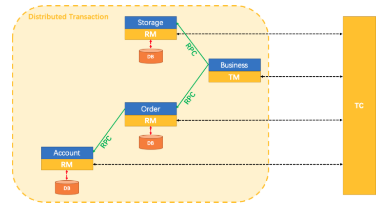
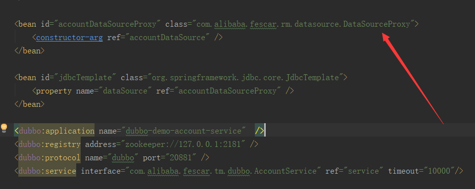
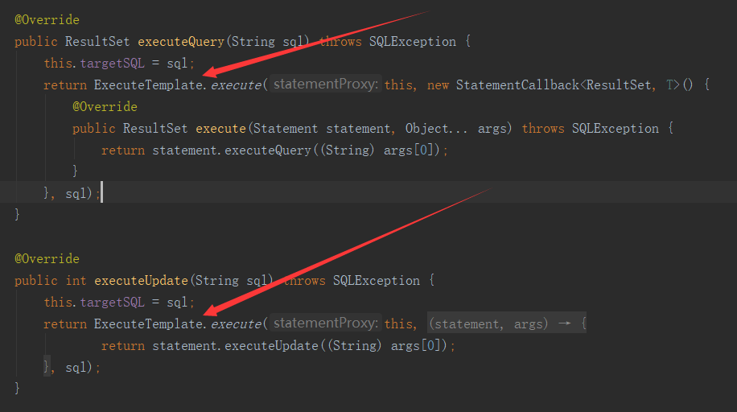
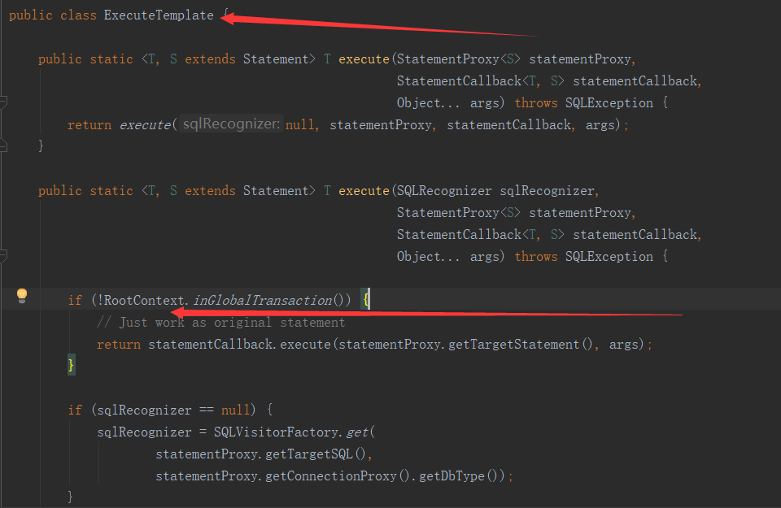
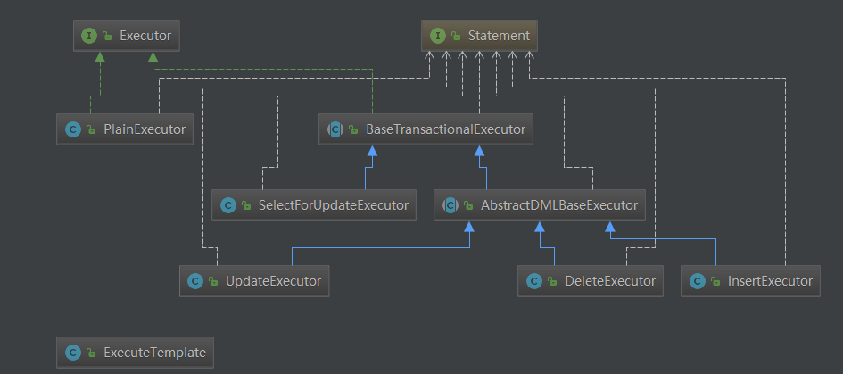
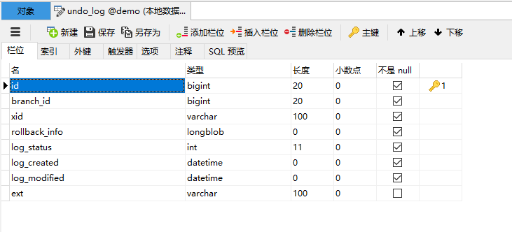
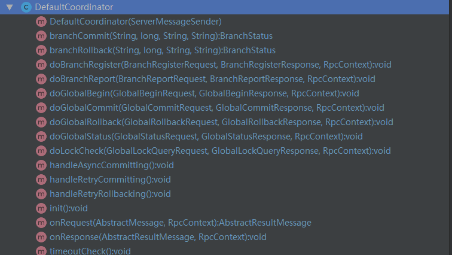

title:Fescar分布式事务原理解析探秘

author:kl

keywords:Fescar、分布式事务

date:2019/02/18


# 前言

fescar发布已有时日，分布式事务一直是业界备受关注的领域，fescar发布一个月左右便受到了近5000个star足以说明其热度。当然，在fescar出来之前，
已经有比较成熟的分布式事务的解决方案开源了，比较典型的方案如LCN（https://github.com/codingapi/tx-lcn）的2pc型无侵入事务，
目前lcn已发展到5.0，已支持和fescar事务模型类似的TCX型事务。还有如TCC型事务实现hmily（https://github.com/yu199195/hmily） tcc-transaction(https://github.com/changmingxie/tcc-transaction)等。
在微服务架构流行的当下、阿里这种开源大户背景下，fescar的发布无疑又掀起了研究分布式事务的热潮。fescar脱胎于阿里云商业分布式事务服务GTS，在线上环境提供这种公共服务其模式肯定经受了非常严苛的考验。其分布式事务模型TXC又仿于传统事务模型XA方案，主要区别在于资源管理器的定位一个在应用层一个在数据库层。博主觉得fescar的txc模型实现非常有研究的价值，所以今天我们来好好翻一翻fescar项目的代码。本文篇幅较长，浏览并理解本文大概耗时30~60分钟左右。

# 项目地址

fescar：https://github.com/alibaba/fescar

本博文所述代码为fescar的0.1.2-SNAPSHOT版本，根据fescar后期的迭代计划，其项目结构和模块实现都可能有很大的改变，特此说明。

# fescar的TXC模型



上图为fescar官方针对TXC模型制作的示意图。不得不说大厂的图制作的真的不错，结合示意图我们可以看到TXC实现的全貌。TXC的实现通过三个组件来完成。也就是上图的三个深黄色部分，其作用如下，：

1.  TM：全局事务管理器，在标注开启fescar分布式事务的服务端开启，并将全局事务发送到TC事务控制端管理
2.  TC：事务控制中心，控制全局事务的提交或者回滚。这个组件需要独立部署维护，目前只支持单机版本，后续迭代计划会有集群版本
3.  RM：资源管理器，主要负责分支事务的上报，本地事务的管理

一段话简述其实现过程：服务起始方发起全局事务并注册到TC。在调用协同服务时，协同服务的事务分支事务会先完成阶段一的事务提交或回滚，并生成事务回滚的undo_log日志，同时注册当前协同服务到TC并上报其事务状态，归并到同一个业务的全局事务中。此时若没有问题继续下一个协同服务的调用，期间任何协同服务的分支事务回滚，都会通知到TC，TC在通知全局事务包含的所有已完成一阶段提交的分支事务回滚。如果所有分支事务都正常，最后回到全局事务发起方时，也会通知到TC，TC在通知全局事务包含的所有分支删除回滚日志。在这个过程中为了解决写隔离和度隔离的问题会涉及到TC管理的全局锁。

本博文的目标是深入代码细节，探究其基本思路是如何实现的。首先会从项目的结构来简述每个模块的作用，继而结合官方自带的examples实例来探究整个分布式事务的实现过程。

# 项目结构解析

项目拉下来，用IDE打开后的目录结构如下，下面先大致的看下每个模块的实现


-   common ：公共组件，提供常用辅助类，静态变量、扩展机制类加载器、以及定义全局的异常等
-   config : 配置加载解析模块，提供了配置的基础接口，目前只有文件配置实现，后续会有nacos等配置中心的实现
-   core : 核心模块主要封装了TM、RM和TC通讯用RPC相关内容
-   dubbo ：dubbo模块主要适配dubbo通讯框架，使用dubbo的filter机制来传统全局事务的信息到分支
-   examples ：简单的演示实例模块，等下从这个模块入手探索
-   rm-datasource :资源管理模块，比较核心的一个模块，个人认为这个模块命名为core要更合理一点。代理了JDBC的一些类，用来解析sql生成回滚日志、协调管理本地事务
-   server : TC组件所在，主要协调管理全局事务，负责全局事务的提交或者回滚，同时管理维护全局锁。
-   spring ：和spring集成的模块，主要是aop逻辑，是整个分布式事务的入口，研究fescar的突破口
-   tm : 全局事务事务管理模块，管理全局事务的边界，全局事务开启回滚点都在这个模块控制

# 通过【examples】模块的实例看下效果

第一步、先启动TC也就是【Server】模块，main方法直接启动就好，默认服务端口8091

第二步、回到examples模块，将订单，业务，账户、仓库四个服务的配置文件配置好，主要是mysql数据源和zookeeper连接地址，这里要注意下，默认dubbo的zk注册中心依赖没有，启动的时候回抛找不到class的异常，需要添加如下的依赖：
```
<dependency>
    <groupId>com.101tec</groupId>
    <artifactId>zkclient</artifactId>
    <version>0.10</version>
    <exclusions>
        <exclusion>
            <artifactId>slf4j-log4j12</artifactId>
            <groupId>org.slf4j</groupId>
        </exclusion>
    </exclusions>
</dependency>
```
第三步、在BusinessServiceImpl中的模拟抛异常的地方打个断点，依次启动OrderServiceImpl、StorageServiceImpl、AccountServiceImpl、BusinessServiceImpl四个服务、等进断点后，查看数据库account\_tbl表，金额已减去400元，变成了599元。然后放开断点、BusinessServiceImpl模块模拟的异常触发，全局事务回滚，account\_tbl表的金额就又回滚到999元了

如上，我们已经体验到fescar事务的控制能力了，下面我们具体看下它是怎么控制的。

# fescar事务过程分析

## 首先分析配置文件

这个是一个铁律，任何一个技术或框架要集成，配置文件肯定是一个突破口。从上面的例子我们了解到，实例模块的配置文件中配置了一个全局事务扫描器实例，如：
```
<bean class="com.alibaba.fescar.spring.annotation.GlobalTransactionScanner">
    <constructor-arg value="dubbo-demo-app"/>
    <constructor-arg value="my\_test\_tx_group"/>
</bean>
```
这个实例在项目启动时会扫描所有实例，具体实现见【spring】模块。并将标注了@GlobalTransactional注解的方法织入GlobalTransactionalInterceptor的invoke方法逻辑。同时应用启动时，会初始化TM（TmRpcClient）和RM（RmRpcClient）的实例，这个时候，服务已经和TC事务控制中心勾搭上了。在往下看就涉及到TM模块的事务模板类TransactionalTemplate。

## 【TM】模块启动全局事务

全局事务的开启，提交、回滚都被封装在TransactionalTemplate中完成了，代码如：
```

public Object execute(TransactionalExecutor business) throws TransactionalExecutor.ExecutionException {
    // 1. get or create a transaction
    GlobalTransaction tx = GlobalTransactionContext.getCurrentOrCreate();
    // 2. begin transaction
    try {
        tx.begin(business.timeout(), business.name());
    } catch (TransactionException txe) {
        throw new TransactionalExecutor.ExecutionException(tx, txe,
            TransactionalExecutor.Code.BeginFailure);
    }
    Object rs = null;
    try {
        // Do Your Business
        rs = business.execute();
    } catch (Throwable ex) {
        // 3. any business exception, rollback.
        try {
            tx.rollback();
            // 3.1 Successfully rolled back
            throw new TransactionalExecutor.ExecutionException(tx, TransactionalExecutor.Code.RollbackDone, ex);
        } catch (TransactionException txe) {
            // 3.2 Failed to rollback
            throw new TransactionalExecutor.ExecutionException(tx, txe,
                TransactionalExecutor.Code.RollbackFailure, ex);
        }
    }
    // 4. everything is fine, commit.
    try {
        tx.commit();
    } catch (TransactionException txe) {
        // 4.1 Failed to commit
        throw new TransactionalExecutor.ExecutionException(tx, txe,
            TransactionalExecutor.Code.CommitFailure);
    }
    return rs;
}
```
更详细的实现在【TM】模块中被分成了两个Class实现，如下：

DefaultGlobalTransaction ：全局事务具体的开启，提交、回滚动作

DefaultTransactionManager ：负责使用TmRpcClient向TC控制中心发送指令，如开启全局事务（GlobalBeginRequest）、提交（GlobalCommitRequest）、回滚（GlobalRollbackRequest）、查询状态（GlobalStatusRequest）等。

以上是TM模块核心内容点，TM模块完成全局事务开启后，接下来就开始看看全局事务iD，xid是如何传递、RM组件是如何介入的

## 【dubbo】全局事务xid的传递

首先是xid的传递，目前已经实现了dubbo框架实现的微服务架构下的传递，其他的像spring cloud和motan等的想要实现也很容易，通过一般RPC通讯框架都有的filter机制，将xid从全局事务的发起节点传递到服务协从节点，从节点接收到后绑定到当前线程上线文环境中，用于在分支事务执行sql时判断是否加入全局事务。fescar的实现见【dubbo】模块如下：
```
@Activate(group = { Constants.PROVIDER, Constants.CONSUMER }, order = 100)
public class TransactionPropagationFilter implements Filter {

    private static final Logger LOGGER = LoggerFactory.getLogger(TransactionPropagationFilter.class);

    @Override
    public Result invoke(Invoker<?> invoker, Invocation invocation) throws RpcException {
        String xid = RootContext.getXID();
        String rpcXid = RpcContext.getContext().getAttachment(RootContext.KEY_XID);
        if (LOGGER.isDebugEnabled()) {
            LOGGER.debug("xid in RootContext\[" + xid + "\] xid in RpcContext\[" + rpcXid + "\]");
        }
        boolean bind = false;
        if (xid != null) {
            RpcContext.getContext().setAttachment(RootContext.KEY_XID, xid);
        } else {
            if (rpcXid != null) {
                RootContext.bind(rpcXid);
                bind = true;
                if (LOGGER.isDebugEnabled()) {
                    LOGGER.debug("bind\[" + rpcXid + "\] to RootContext");
                }
            }
        }
        try {
            return invoker.invoke(invocation);

        } finally {
            if (bind) {
                String unbindXid = RootContext.unbind();
                if (LOGGER.isDebugEnabled()) {
                    LOGGER.debug("unbind\[" + unbindXid + "\] from RootContext");
                }
                if (!rpcXid.equalsIgnoreCase(unbindXid)) {
                    LOGGER.warn("xid in change during RPC from " + rpcXid + " to " + unbindXid);
                    if (unbindXid != null) {
                        RootContext.bind(unbindXid);
                        LOGGER.warn("bind \[" + unbindXid + "\] back to RootContext");
                    }
                }
            }
        }
    }
}
```
上面代码rpcXid不为空时，就加入到了RootContext的ContextCore中，这里稍微深入讲下。ContextCore是一个可扩展实现的接口，目前默认的实现是ThreadLocalContextCore，基于ThreadLocal来保存维护当前的xid。这里fescar提供了可扩展的机制，实现在【common】模块中，通过一个自定义的类加载器EnhancedServiceLoader加载需要扩展的服务类，这样只需要在扩展类加上@LoadLevel注解。标记order属性声明高优先级别，就可以达到扩展实现的目的。

## 【RM】模块本地资源管理的介入

fescar针对本地事务相关的接口，通过代理机制都实现了一遍代理类，如数据源（DataSourceProxy）、ConnectionProxy、StatementProxy等。这个在配置文件中也可以看出来，也就是说，我们要使用fescar分布式事务，一定要配置fescar提供的代理数据源。如：



配置好代理数据源后，从DataSourceProxy出发，本地针对数据库的所有操作过程我们就可以随意控制了。从上面xid传递，已经知道了xid被保存在RootContext中了，那么请看下面的代码，就非常清楚了：

首先看StatementProxy的一段代码



在看ExecuteTemplate中的代码



和【TM】模块中的事务管理模板类TransactionlTemplate类似，这里非常关键的逻辑代理也被封装在了ExecuteTemplate模板类中。因重写了Statement有了StatementProxy实现，在执行原JDBC的executeUpdate方法时，会调用到ExecuteTemplate的execute逻辑。在sql真正执行前，会判断RootCOntext当前上下文中是否包含xid，也就是判断当前是否是全局分布式事务。如果不是，就直接使用本地事务，如果是，这里RM就会增加一些分布式事务相关的逻辑了。这里根据sql的不同的类型，fescar封装了五个不同的执行器来处理，分别是UpdateExecutor、DeleteExecutor、InsertExecutor、SelectForUpdateExecutor、PlainExecutor，结构如下图：



### PlainExecutor：

原生的JDBC接口实现，未做任何处理，提供给全局事务中的普通的select查询使用

### UpdateExecutor、DeleteExecutor、InsertExecutor：

三个DML增删改执行器实现，主要在sql执行的前后对sql语句进行了解析，实现了如下两个抽象接口方法：
```
protected abstract TableRecords beforeImage() throws SQLException;

protected abstract TableRecords afterImage(TableRecords beforeImage) throws SQLException;
```
在这个过程中通过解析sql生成了提供回滚操作的undo_log日志，日志目前是保存在msyql中的，和业务sql操作共用同一个事务。表的结构如下：



rollback\_info保存的undo\_log详细信息，是longblob类型的，结构如下：

```
{
    "branchId":3958194,
    "sqlUndoLogs":[
        {
            "afterImage":{
                "rows":[
                    {
                        "fields":[
                            {
                                "keyType":"PrimaryKey",
                                "name":"ID",
                                "type":4,
                                "value":10
                            },
                            {
                                "keyType":"NULL",
                                "name":"COUNT",
                                "type":4,
                                "value":98
                            }
                        ]
                    }
                ],
                "tableName":"storage_tbl"
            },
            "beforeImage":{
                "rows":[
                    {
                        "fields":[
                            {
                                "keyType":"PrimaryKey",
                                "name":"ID",
                                "type":4,
                                "value":10
                            },
                            {
                                "keyType":"NULL",
                                "name":"COUNT",
                                "type":4,
                                "value":100
                            }
                        ]
                    }
                ],
                "tableName":"storage_tbl"
            },
            "sqlType":"UPDATE",
            "tableName":"storage_tbl"
        }
    ],
    "xid":"192.168.7.77:8091:3958193"
}


```

这里贴的是一个update的操作，undo\_log记录的非常的详细，通过全局事务xid关联branchid，记录数据操作的表名，操作字段名，以及sql执行前后的记录数，如这个记录，表名=storage\_tbl,sql执行前ID=10，count=100，sql执行后id=10，count=98。如果整个全局事务失败，需要回滚的时候就可以生成：
```
update storage_tbl set count = 100 where id = 10;
```
这样的回滚sql语句执行了。

### SelectForUpdateExecutor：

fescar的AT模式在本地事务之上默认支持读未提交的隔离级别，但是通过SelectForUpdateExecutor执行器，可以支持读已提交的隔离级别。代码如：
```
@Override
public Object doExecute(Object... args) throws Throwable {
    SQLSelectRecognizer recognizer = (SQLSelectRecognizer) sqlRecognizer;

    Connection conn = statementProxy.getConnection();
    ResultSet rs = null;
    Savepoint sp = null;
    LockRetryController lockRetryController = new LockRetryController();
    boolean originalAutoCommit = conn.getAutoCommit();

    StringBuffer selectSQLAppender = new StringBuffer("SELECT ");
    selectSQLAppender.append(getTableMeta().getPkName());
    selectSQLAppender.append(" FROM " + getTableMeta().getTableName());
    String whereCondition = null;
    ArrayList<Object> paramAppender = new ArrayList<>();
    if (statementProxy instanceof ParametersHolder) {
        whereCondition = recognizer.getWhereCondition((ParametersHolder) statementProxy, paramAppender);
    } else {
        whereCondition = recognizer.getWhereCondition();
    }
    if (!StringUtils.isEmpty(whereCondition)) {
        selectSQLAppender.append(" WHERE " + whereCondition);
    }
    selectSQLAppender.append(" FOR UPDATE");
    String selectPKSQL = selectSQLAppender.toString();

    try {
        if (originalAutoCommit) {
            conn.setAutoCommit(false);
        }
        sp = conn.setSavepoint();
        rs = statementCallback.execute(statementProxy.getTargetStatement(), args);

        while (true) {
            // Try to get global lock of those rows selected
            Statement stPK = null;
            PreparedStatement pstPK = null;
            ResultSet rsPK = null;
            try {
                if (paramAppender.isEmpty()) {
                    stPK = statementProxy.getConnection().createStatement();
                    rsPK = stPK.executeQuery(selectPKSQL);
                } else {
                    pstPK = statementProxy.getConnection().prepareStatement(selectPKSQL);
                    for (int i = 0; i < paramAppender.size(); i++) {
                        pstPK.setObject(i + 1, paramAppender.get(i));
                    }
                    rsPK = pstPK.executeQuery();
                }

                TableRecords selectPKRows = TableRecords.buildRecords(getTableMeta(), rsPK);
                statementProxy.getConnectionProxy().checkLock(selectPKRows);
                break;

            } catch (LockConflictException lce) {
                conn.rollback(sp);
                lockRetryController.sleep(lce);

            } finally {
                if (rsPK != null) {
                    rsPK.close();
                }
                if (stPK != null) {
                    stPK.close();
                }
                if (pstPK != null) {
                    pstPK.close();
                }
            }
        }

    } finally {
        if (sp != null) {
            conn.releaseSavepoint(sp);
        }
        if (originalAutoCommit) {
            conn.setAutoCommit(true);
        }
    }
    return rs;
}
```
关键代码见：
```
TableRecords selectPKRows = TableRecords.buildRecords(getTableMeta(), rsPK);
statementProxy.getConnectionProxy().checkLock(selectPKRows);
```
通过selectPKRows表操作记录拿到lockKeys，然后到TC控制器端查询是否被全局锁定了，如果被锁定了，就重新尝试，直到锁释放返回查询结果。

## 分支事务的注册和上报

在本地事务提交前，fescar会注册和上报分支事务相关的信息，见ConnectionProxy类的commit部分代码：
```
@Override
public void commit() throws SQLException {
    if (context.inGlobalTransaction()) {
        try {
            register();
        } catch (TransactionException e) {
            recognizeLockKeyConflictException(e);
        }

        try {
            if (context.hasUndoLog()) { 
                UndoLogManager.flushUndoLogs(this);
            }
            targetConnection.commit();
        } catch (Throwable ex) {
            report(false);
            if (ex instanceof SQLException) {
                throw (SQLException) ex;
            } else {
                throw new SQLException(ex);
            }
        }
        report(true);
        context.reset();
       
    } else {
        targetConnection.commit();
    }
}
```
从这段代码我们可以看到，首先是判断是了是否是全局事务，如果不是，就直接提交了，如果是，就先向TC控制器注册分支事务，为了写隔离，在TC端会涉及到全局锁的获取。然后保存了用于回滚操作的undo_log日志，继而真正提交本地事务，最后向TC控制器上报事务状态。此时，阶段一的本地事务已完成了。

## 【server】模块协调全局

关于server模块，我们可以聚焦在DefaultCoordinator这个类，这个是AbstractTCInboundHandler控制处理器默认实现。主要实现了全局事务开启，提交，回滚，状态查询，分支事务注册，上报，锁检查等接口，如：



回到一开始的TransactionlTemplate，如果整个分布式事务失败需要回滚了，首先是TM向TC发起回滚的指令，然后TC接收到后，解析请求后会被路由到默认控制器类的doGlobalRollback方法内，最终在TC控制器端执行的代码如下：
```
@Override
public void doGlobalRollback(GlobalSession globalSession, boolean retrying) throws TransactionException {
    for (BranchSession branchSession : globalSession.getReverseSortedBranches()) {
        BranchStatus currentBranchStatus = branchSession.getStatus();
        if (currentBranchStatus == BranchStatus.PhaseOne_Failed) {
            continue;
        }
        try {
            BranchStatus branchStatus = resourceManagerInbound.branchRollback(XID.generateXID(branchSession.getTransactionId()), branchSession.getBranchId(),
                    branchSession.getResourceId(), branchSession.getApplicationData());

            switch (branchStatus) {
                case PhaseTwo_Rollbacked:
                    globalSession.removeBranch(branchSession);
                    LOGGER.error("Successfully rolled back branch " + branchSession);
                    continue;
                case PhaseTwo\_RollbackFailed\_Unretryable:
                    GlobalStatus currentStatus = globalSession.getStatus();
                    if (currentStatus.name().startsWith("Timeout")) {
                        globalSession.changeStatus(GlobalStatus.TimeoutRollbackFailed);
                    } else {
                        globalSession.changeStatus(GlobalStatus.RollbackFailed);
                    }
                    globalSession.end();
                    LOGGER.error("Failed to rollback global\[" + globalSession.getTransactionId() + "\] since branch\[" + branchSession.getBranchId() + "\] rollback failed");
                    return;
                default:
                    LOGGER.info("Failed to rollback branch " + branchSession);
                    if (!retrying) {
                        queueToRetryRollback(globalSession);
                    }
                    return;

            }
        } catch (Exception ex) {
            LOGGER.info("Exception rollbacking branch " + branchSession, ex);
            if (!retrying) {
                queueToRetryRollback(globalSession);
                if (ex instanceof TransactionException) {
                    throw (TransactionException) ex;
                } else {
                    throw new TransactionException(ex);
                }
            }

        }

    }
    GlobalStatus currentStatus = globalSession.getStatus();
    if (currentStatus.name().startsWith("Timeout")) {
        globalSession.changeStatus(GlobalStatus.TimeoutRollbacked);
    } else {
        globalSession.changeStatus(GlobalStatus.Rollbacked);
    }
    globalSession.end();
}
```
如上代码可以看到，回滚时从全局事务会话中迭代每个分支事务，然后通知每个分支事务回滚。分支服务接收到请求后，首先会被路由到RMHandlerAT中的doBranchRollback方法，继而调用了RM中的branchRollback方法，代码如下：
```
@Override
public BranchStatus branchRollback(String xid, long branchId, String resourceId, String applicationData) throws TransactionException {
    DataSourceProxy dataSourceProxy = get(resourceId);
    if (dataSourceProxy == null) {
        throw new ShouldNeverHappenException();
    }
    try {
        UndoLogManager.undo(dataSourceProxy, xid, branchId);
    } catch (TransactionException te) {
        if (te.getCode() == TransactionExceptionCode.BranchRollbackFailed_Unretriable) {
            return BranchStatus.PhaseTwo\_RollbackFailed\_Unretryable;
        } else {
            return BranchStatus.PhaseTwo\_RollbackFailed\_Retryable;
        }
    }
    return BranchStatus.PhaseTwo_Rollbacked;
}
```
RM分支事务端最后执行的是UndoLogManager的undo方法，通过xid和branchid从数据库查询出回滚日志，完成数据回滚操作，整个过程都是同步完成的。如果全局事务是成功的，TC也会有类似的上述协调过程，只不过是异步的将本次全局事务相关的undo_log清除了而已。至此，就完成了2阶段的提交或回滚，也就完成了完整的全局事务事务的控制。

# 结语

如果你看到这里，那么非常感谢你，在繁忙工作之余耐心的花时间来学习。同时，我相信花的时间没白费，完整的浏览理解估计对fescar实现的大致流程了解的十之八九了。本文从构思立题到完成大概耗时1人天左右，博主在这个过程中，对fescar的实现也有了更加深入的了解。由于篇幅原因，并没有面面俱到的对每个实现的细节去深究，如sql是如何解析的等，更多的是在fescar的TXC模型的实现过程的关键点做了详细阐述。本文已校对，但由于个人知识水平及精力有限，文中不免出现错误或理解不当的地方，欢迎指正。

### 作者简介：

陈凯玲，2016年5月加入凯京科技。曾任职高级研发和项目经理，现任凯京科技研发中心架构&运维部负责人。pmp项目管理认证，阿里云MVP。热爱开源，先后开源过多个热门项目。热爱分享技术点滴，独立博客KL博客（[http://www.kailing.pub](http://www.kailing.pub/)）博主。
