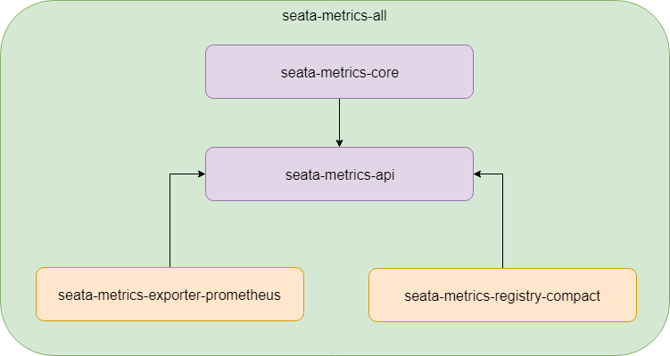
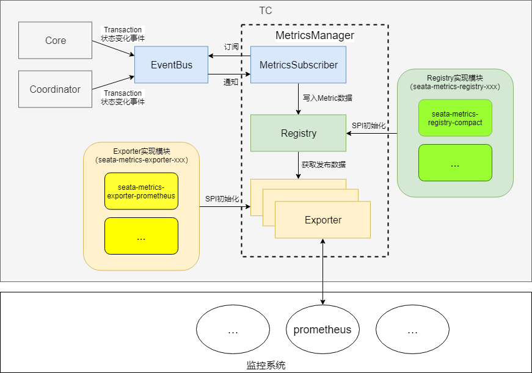

Seata 0.7.0版本中将包含全新的特性——Metrics，作为APM（Application Performance Management & Monitoring）三大基石之一，通过它可以快速详尽的获取到TC、TM（规划中）和RM（规划中）中事务的活动状态以及时延等重要统计信息。

## 设计思路

1. Seata作为一个被集成的数据一致性框架，Metrics模块将尽可能少的使用第三方依赖以降低发生冲突的风险；例如不使用Spring Bean机制，而是使用SPI(Service Provider Interface)加载扩展。
2. Metrics模块将竭力争取更高的度量性能和更低的资源开销，尽可能降低开启后带来的副作用；
3. 配置式，Metrics是否激活、数据如何发布，取决于对应的配置；
4. 开始仅在TC中完成核心Transaction相关指标的实现，之后结合社区的需求，逐步完善运维所需的其他指标。

## 模块说明

Seata Metrics的模块全部在`seata-metrics`下，0.7版本包含：



由2个核心API模块`seata-metrics-api`和`seata-metrics-core`，以及N个实现模块例如`seata-metrics-registry-compact`、`seata-metrics-exporter-prometheus`构成：

- seata-metrics-api模块

此模块是Metrics的核心，将作为Seata基础架构的一部分被TC、TM和RM引用，它内部**没有任何具体实现代码**，仅包含接口定义，定义的内容包括：
1. Meter类接口：`Gauge`、`Counter`、`Timer`...
2. 注册容器接口`Registry`
3. Measurement数据导出接口`Exporter`

>提示：Metrics本身在开源领域也已有很多实现，例如
>1. [Netflix-Spectator](https://github.com/Netflix/spectator)
>2. [Dropwizard-Metrics](https://github.com/dropwizard/metrics)
>3. [Dubbo-Metrics](https://github.com/dubbo/dubbo-metrics)

>它们有的轻而敏捷，有的重而强大，由于也是“实现”，因此不会纳入`seata-metrics-api`中，避免实现绑定。

- seata-metrics-core模块

Metrics核心模块，根据配置组织（加载）1个Registry和N个Exporter；

- seata-metrics-registry-compact模块

这是我们提供的默认（内置）的Registry实现，不使用其它Metrics开源库，轻量级的实现了以下四种Meter：

| Meter类型  | 描述                                                                                                                         |
| --------- | ------------------------------------------------------------ |
| CompactGauge     | 单一最新值度量器                                                                                                                |
| CompactCounter   | 单一累加度量器，可增可减                                                                                                         |
| CompactSummary   | 多Measurement输出计数器，将输出`total`(合计)、`count`(计数)、`max`(最大)、`average`(合计/计数)和`tps`(合计/时间间隔)，无单位  |
| CompactTimer     | 多Measurement输出计时器，将输出`total`(合计)、`count`(计数)、`max`(最大)和`average`(合计/计数)，支持微秒为单位累计              |

其中包含的Registry，即`CompactRegistry`，它只有接受measure()方法调用的时候才计算度量值，因此计算窗口完全取决于Exporter的实现，故目前不太适合需要多Exporter的场景使用（如何扩展请参见后文）。

>说明：
>1. 未来可能增加更丰富复杂的度量器例如Histogram，这是一种可以本地统计聚合75th, 90th, 95th, 98th, 99th,99.9th...的度量器，适合某些场合，但需要更多内存。
>2. 所有的计量器都将继承自Meter，所有的计量器执行measure()方法后，都将归一化的生成1或N个Measurement结果。

- seata-metrics-exporter-prometheus模块

Prometheus发布器`PrometheusExporter`，将度量数据同步给Prometheus。

>说明：不同的监控系统，采集度量数据的方式不尽相同，例如Zabbix支持用zabbix-agent推送，Prometheus则推荐使用prometheus-server[拉取](https://prometheus.io/docs/practices/pushing/)的方式；同样数据交换协议也不同，因此往往需要逐一适配。

## 工作原理



TC中Metrics的初始化步骤和工作原理如下：

1. Server调用MetricsManager.get().init()启动Metrics的初始化；
2. MetricsManager读取配置，通过SPI初始化对应的1个Registry和N个Exporter（分别通过RegistryFactory和ExporterFactory）；
3. 如果初始化成功，代表用户启用了Metrics特性，初始化MetricsSubscriber并注册到EventBus；
4. DefaultCore和DefaultCoordinator根据Transaction的状态变化触发对应状态的事件，MetricsSubscriber根据状态，记录对应的Metric至Registry；
5. Exporter定期从Registry中获取数据，发布到外部对接的监控系统。

可以看出，Metrics定位为一个可选特性，如果不配置，事件订阅器MetricsSubscriber并不会创建和注册，避免无谓的性能开销。

## 如何使用

如果需要开启TC的Metrics，需要在其配置中增加配置项：

```text
## metrics settings
metrics {
  registry-type = "compact"
  # multi exporters use comma divided
  exporter-list = "prometheus"
  exporter-prometheus-port = 9898
}
```

启动TC，即可在`http://tc-server-ip:9898/metrics`上获取到Metrics的文本格式数据。

>提示：默认使用`9898`端口，Prometheus已登记的端口列表[在此](https://github.com/prometheus/prometheus/wiki/Default-port-allocations)，如果想更换端口，可通过`metrics.exporter-prometheus-port`配置修改。

### 下载并启动Prometheus

下载完毕后，修改Prometheus的配置文件`prometheus.yml`，在`scrape_configs`中增加一项抓取Seata的度量数据：

```yaml
scrape_configs:
  # The job name is added as a label `job=<job_name>` to any timeseries scraped from this config.
  - job_name: 'prometheus'

    # metrics_path defaults to '/metrics'
    # scheme defaults to 'http'.

    static_configs:
    - targets: ['localhost:9090']

  - job_name: 'seata'

    # metrics_path defaults to '/metrics'
    # scheme defaults to 'http'.

    static_configs:
    - targets: ['tc-server-ip:9898']
```

### 查看数据输出

推荐结合配置[Grafana](https://prometheus.io/docs/visualization/grafana/)获得更好的查询效果，目前Seata导出的Metrics包括：

| Metrics    | 描述    |
| ------ | --------- |
| seata.transaction(role=tc,meter=counter,status=active/committed/rollback) | 当前活动中/已提交/已回滚的事务总数  |
| seata.transaction(role=tc,meter=summary,statistic=count,status=committed/rollback) | 当前周期内提交/回滚的事务数  |
| seata.transaction(role=tc,meter=summary,statistic=tps,status=committed/rollback) | 当前周期内提交/回滚的事务TPS(transaction per second) |
| seata.transaction(role=tc,meter=timer,statistic=total,status=committed/rollback) | 当前周期内提交/回滚的事务耗时总和 |
| seata.transaction(role=tc,meter=timer,statistic=count,status=committed/rollback) | 当前周期内提交/回滚的事务数  |
| seata.transaction(role=tc,meter=timer,statistic=average,status=committed/rollback) | 当前周期内提交/回滚的事务平均耗时   |
| seata.transaction(role=tc,meter=timer,statistic=max,status=committed/rollback) | 当前周期内提交/回滚的事务最大耗时 |

>提示：seata.transaction(role=tc,meter=summary,statistic=count,status=committed/rollback)和seata.transaction(role=tc,meter=timer,statistic=count,status=committed/rollback)的值可能相同，但它们来源于两个不同的度量器。

## 如何扩展

如果有下面几种情况：

1. 您不是使用Prometheus作为运维监控系统，但希望能够将Seata的Metrics数据集成进Dashboard中；

您需要实现新的Exporter，例如如果需要对接Zabbix，创建`seata-metrics-exporter-zabbix`模块，然后在ExporterType中添加新的Exporter类型，最后在`metrics.exporter-list`中配置。

2. 您需要更复杂强大的度量器类型，这些度量器在其他Metrics实现库中已有，希望集成这些第三方依赖直接使用；

您可以不使用内置的CompactRegistry的实现，完全扩展一个新的Registry库，例如希望使用Netflix Spectator的实现，扩展名为`seata-metrics-registry-spectator`的模块，然后在RegistryType中添加新的Registry类型，开发完成后，设置`metrics.registry-type`为对应的类型。

3. 您需要改变默认Metric的Measurement输出，例如在Timer中增加一个`min`或`sd`(方差)；

您可以修改对应Meter的实现，包括`measure()`方法返回的Measurement列表。

## 未来规划

1. 为TM和RM追加Metrics特性：

- TM：

稍后实现，包括诸如：
seata.transaction(role=tm,name={GlobalTransactionalName},meter=counter,status=active/committed/rollback) : 以GlobalTransactionalName为维度区分不同Transactional的状态。

- RM：

稍后实现，包括诸如：
seata.transaction(role=rm,name={BranchTransactionalName},mode=at/mt,meter=counter,status=active/committed/rollback)：以BranchTransactionalName为维度以及AT/MT维度区分不同分支Transactional的状态。

2. 响应社区，扩展更多的Registry和Exporter，以及支持更丰富的Meter。

## 结束语

本文介绍的Metrics是一个侵入式特性，如果用户希望只使用无侵入的Metrics，则可以使用[SkyWalking](https://github.com/apache/skywalking)在6.3版本中增加的与Seata集成的方案。

#### 作者简介

郑扬勇，云粒智慧技术专家，开源爱好者，关注微服务、IOT领域技术，希望通过参与开源帮助别人的同时帮助自己。