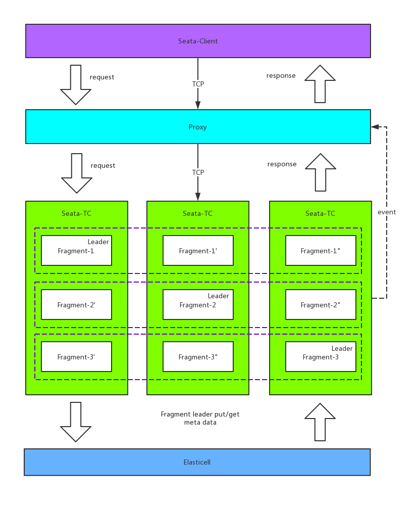
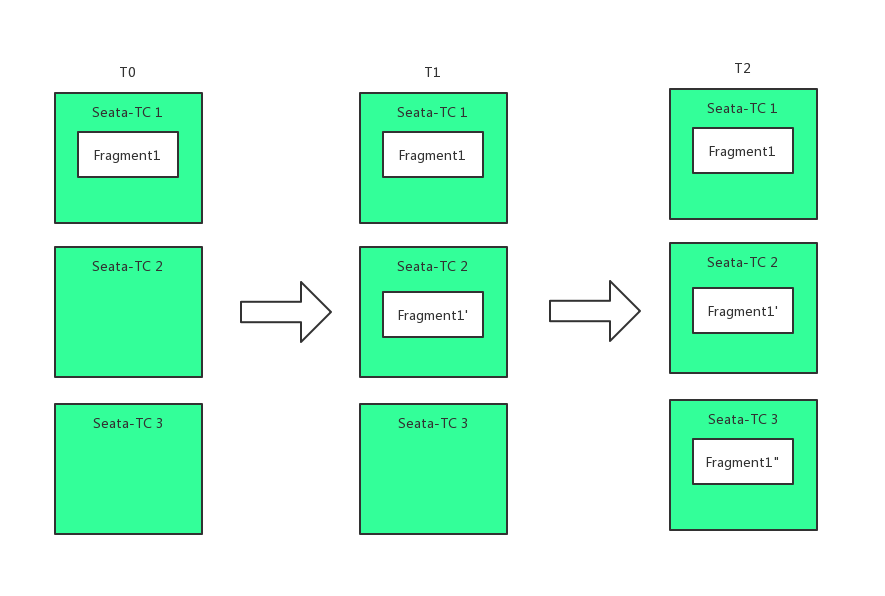
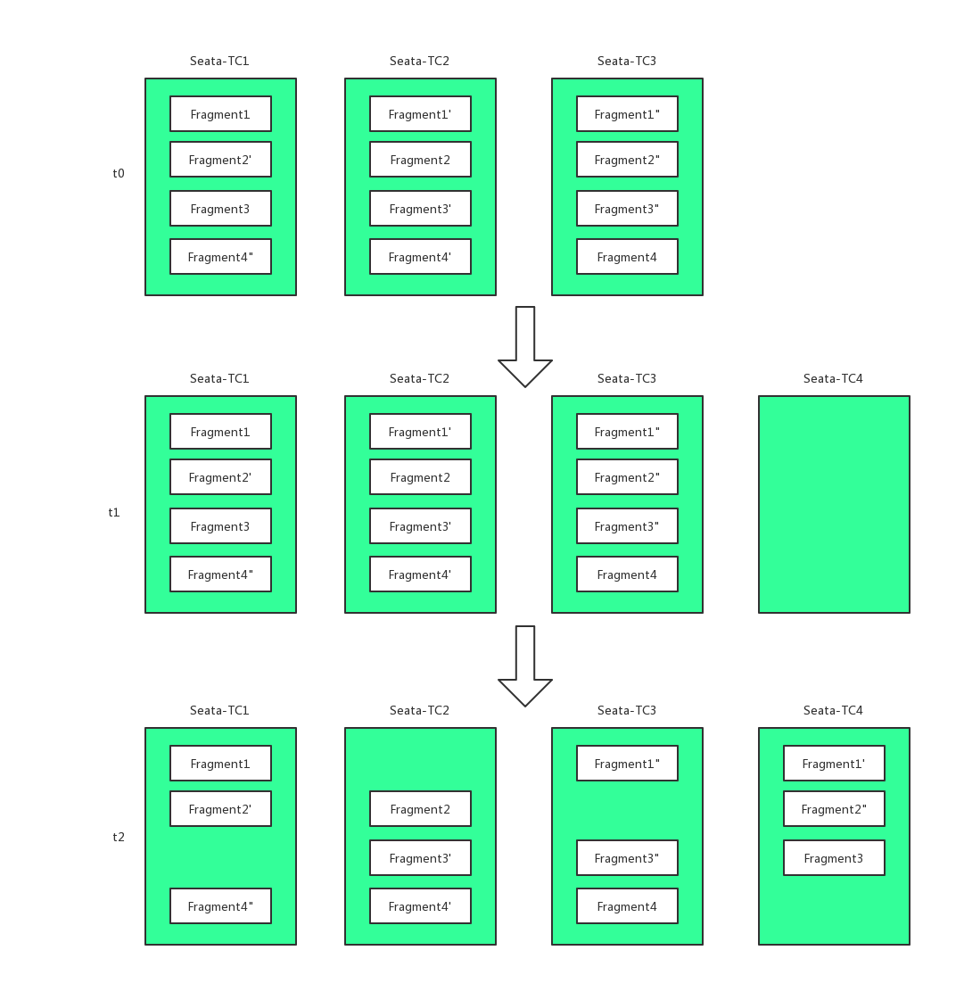

# Seata 高可用服务端 TaaS 正式开源

### 前言
TaaS 是 Seata 服务端（TC, Transaction Coordinator）的一种高可用实现，使用 `Golang` 编写。Taas 由InfiniVision (http://infinivision.cn) 贡献给Seata开源社区。现已正式开源，并贡献给 Seata 社区。

在Seata开源之前，我们内部开始借鉴GTS以及一些开源项目来实现分布式事务的解决方案TaaS(Transaction as a Service)。

在我们完成TaaS的服务端的开发工作后，Seata（当时还叫Fescar）开源了，并且引起了开源社区的广泛关注，加上阿里巴巴的平台影响力以及社区活跃度，我们认为Seata会成为今后开源分布式事务的标准，我们决定TaaS兼容Seata。

在发现Seata的服务端的实现是单机的，高可用等并没有实现，于是我们与Seata社区负责人取得联系，并且决定把TaaS开源，回馈开源社区。 同时，我们会长期维护，并且和Seata版本保持同步。

目前，Seata官方的Java高可用版本也在开发中，TaaS和该高可用版本的设计思想不同，在今后会长期共存。

TaaS已经开源， github (https://github.com/seata/taas)，欢迎大家试用。

### 设计原则
1. 高性能，性能和机器数量成正比，即通过加入新机器到集群中，就可以提升性能
2. 高可用，一台机器出现故障，系统能依旧可以对外提供服务，或者在较短的时间内恢复对外服务（Leader切换的时间）
3. Auto-Rebalance，集群中增加新的机器，或者有机器下线，系统能够自动的做负载均衡
4. 强一致，系统的元数据强一致在多个副本中存储

### 设计


#### 高性能
TaaS的性能和机器数量成正比，为了支持这个特性，在TaaS中处理全局事务的最小单元称为`Fragment`，系统在启动的时候会设定每个Fragment支持的活跃全局事务的并发数，同时系统会对每个Fragment进行采样，一旦发现Fragment超负荷，会生成新的Fragment来处理更多的并发。

#### 高可用
每个`Fragment`有多个副本和一个Leader，由Leader来处理请求。当Leader出现故障，系统会产生一个新的Leader来处理请求，在新Leader的选举过程中，这个Fragment对外不提供服务，通常这个间隔时间是几秒钟。

#### 强一致
TaaS本身不存储全局事务的元数据，元数据存储在Elasticell   (https://github.com/deepfabric/elasticell) 中，Elasticell是一个兼容redis协议的分布式的KV存储，它基于Raft协议来保证数据的一致性。

#### Auto-Rebalance
随着系统的运行，在系统中会存在许多`Fragment`以及它们的副本，这样会导致在每个机器上，`Fragment`的分布不均匀，特别是当旧的机器下线或者新的机器上线的时候。TaaS在启动的时候，会选择3个节点作为调度器的角色，调度器负责调度这些`Fragment`，用来保证每个机器上的Fragment的数量以及Leader个数大致相等，同时还会保证每个Fragment的副本数维持在指定的副本个数。

##### Fragment副本创建


1. t0时间点，Fragment1在Seata-TC1机器上创建
2. t1时间点，Fragment1的副本Fragment1'在Seata-TC2机器上创建
3. t2时间点，Fragment1的副本Fragment1"在Seata-TC3机器上创建

在t2时间点，Fragment1的三个副本创建完毕。

##### Fragment副本迁移

1. t0时刻点，系统一个存在4个Fragment，分别存在于Seata-TC1，Seata-TC2，Seata-TC3三台机器上
2. t1时刻，加入新机器Seata-TC4
3. t2时刻，有3个Fragment的副本被迁移到了Seata-TC4这台机器上

### 在线快速体验
我们在公网搭建了一个体验的环境：
* Seata服务端地址： 39.97.115.141:8091
* UI： http://39.97.115.141:8084/ui/index.html

### 本地快速体验
使用docker-compose快速体验TaaS的功能。
```bash
git clone https://github.com/seata/taas.git
docker-compse up -d
```
由于组件依赖较多，docker-compose启动30秒后，可以对外服务

#### Seata服务地址
服务默认监听在8091端口，修改Seata对应的服务端地址体验

#### Seata UI 
访问WEB UI `http://127.0.0.1:8084/ui/index.html`

### 关于InfiniVision
深见网络是一家技术驱动的企业级服务提供商，致力于利用人工智能、云计算、区块链、大数据，以及物联网边缘计算技术助力传统企业的数字化转型和升级。深见网络积极拥抱开源文化并将核心算法和架构开源，知名人脸识别软件 InsightFace (https://github.com/deepinsight/insightface) (曾多次获得大规模人脸识别挑战冠军)，以及分布式存储引擎 Elasticell (https://github.com/deepfabric/elasticell) 等均是深见网络的开源产品。

### 关于作者
作者张旭，开源网关Gateway (https://github.com/fagongzi/gateway) 作者，目前就职于InfiniVision，负责基础架构相关的研发工作。
