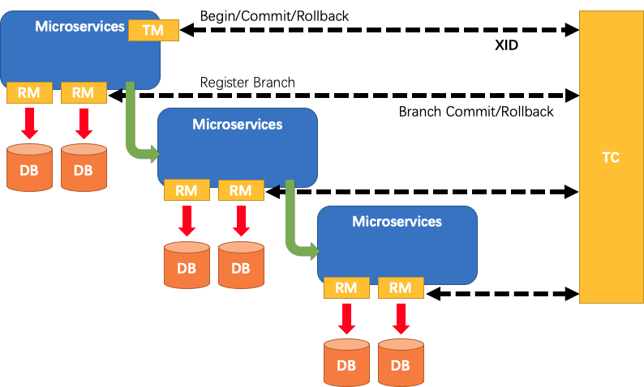
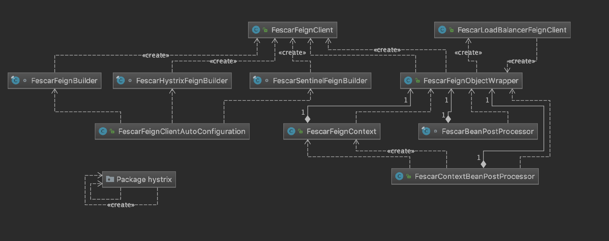

# Fescar 与 Spring Cloud 集成源码深度剖析

### Fescar 简介

常见的分布式事务方式有基于 2PC 的 XA (e.g. atomikos)，从业务层入手的 TCC( e.g. byteTCC)、事务消息 ( e.g. RocketMQ Half Message) 等等。XA 是需要本地数据库支持的分布式事务的协议，资源锁在数据库层面导致性能较差，而支付宝作为布道师引入的 TCC 模式需要大量的业务代码保证，开发维护成本较高。

分布式事务是业界比较关注的领域，这也是短短时间 Fescar 能收获6k Star的原因之一。Fescar 名字取自 **Fast & Easy Commit And Rollback** ，简单来说 Fescar 通过对本地 RDBMS 分支事务的协调来驱动完成全局事务，是工作在应用层的中间件。主要优点是相对于XA模式是性能较好不长时间占用连接资源，相对于 TCC 方式开发成本和业务侵入性较低。

类似于 XA，Fescar 将角色分为 TC、RM、TM，事务整体过程模型如下：



```
1. TM 向 TC 申请开启一个全局事务，全局事务创建成功并生成一个全局唯一的 XID。
2. XID 在微服务调用链路的上下文中传播。
3. RM 向 TC 注册分支事务，将其纳入 XID 对应全局事务的管辖。
4. TM 向 TC 发起针对 XID 的全局提交或回滚决议。
5. TC 调度 XID 下管辖的全部分支事务完成提交或回滚请求。
```

其中在目前的实现版本中 TC 是独立部署的进程，维护全局事务的操作记录和全局锁记录，负责协调并驱动全局事务的提交或回滚。TM RM 则与应用程序工作在同一应用进程。RM 对 JDBC 数据源采用代理的方式对底层数据库做管理，利用语法解析，在执行事务时保留快照，并生成 undo log。大概的流程和模型划分就介绍到这里，下面开始对 Fescar 事务传播机制的分析。

### Fescar 事务传播机制

Fescar 事务传播包括应用内事务嵌套调用和跨服务调用的事务传播。Fescar 事务是怎么在微服务调用链中传播的呢？Fescar 提供了事务 API 允许用户手动绑定事务的 XID 并加入到全局事务中，所以我们根据不同的服务框架机制，将 XID 在链路中传递即可实现事务的传播。

RPC 请求过程分为调用方与被调用方两部分，我们需要对 XID 在请求与响应时做相应的处理。大致过程为：调用方即请求方将当前事务上下文中的 XID 取出，通过RPC协议传递给被调用方；被调用方从请求中的将 XID 取出，并绑定到自己的事务上下文中，纳入全局事务。微服务框架一般都有相应的 Filter 和 Interceptor 机制，我们来具体分析下 Spring Cloud 与Fescar 的整合过程。

### Fescar 与 Spring Cloud Alibaba 集成部分源码解析 

本部分源码全部来自于 spring-cloud-alibaba-fescar. 源码解析部分主要包括 AutoConfiguration、微服务被调用方和微服务调用方三大部分。对于微服务调用方方式具体分为 RestTemplate 和 Feign，其中对于 Feign 请求方式又进一步细分为结合 Hystrix 和 Sentinel 的使用模式。

#### Fescar AutoConfiguration
对于 AutoConfiguration 的解析此处只介绍与 Fescar 启动相关的部分，其他部分的解析将穿插于【微服务被调用方】和 【微服务调用方】章节进行介绍。

Fescar 的启动需要配置 GlobalTransactionScanner，GlobalTransactionScanner 负责初始化 Fescar 的 RM client、TM  client 和 自动代理标注 GlobalTransactional 注解的类。GlobalTransactionScanner bean 的启动通过 GlobalTransactionAutoConfiguration 加载并注入FescarProperties。   
FescarProperties 包含了 Fescar 的重要属性 txServiceGroup ，此属性的可通过 application.properties 文件中的 key: spring.cloud.alibaba.fescar.txServiceGroup 读取，默认值为 ${spring.application.name}-fescar-service-group 。txServiceGroup 表示 Fescar 的逻辑事务分组名，此分组名通过配置中心（目前支持文件、Apollo）获取逻辑事务分组名对应的 TC 集群名称，进一步通过集群名称构造出 TC 集群的服务名，通过注册中心（目前支持nacos、redis、zk和eureka）和服务名找到可用的 TC 服务节点，然后 RM client、TM  client 与 TC 进行 rpc 交互。

#### 微服务被调用方

由于调用方的逻辑比较多一点，我们先分析被调用方的逻辑。针对于 Spring Cloud 项目，默认采用的 RPC 传输协议是 HTTP 协议，所以使用了 HandlerInterceptor 机制来对HTTP的请求做拦截。

HandlerInterceptor 是 Spring 提供的接口， 它有以下三个方法可以被覆写。

```java
    /**
	 * Intercept the execution of a handler. Called after HandlerMapping determined
	 * an appropriate handler object, but before HandlerAdapter invokes the handler.
	 */
	default boolean preHandle(HttpServletRequest request, HttpServletResponse response, Object handler)
			throws Exception {

		return true;
	}

	/**
	 * Intercept the execution of a handler. Called after HandlerAdapter actually
	 * invoked the handler, but before the DispatcherServlet renders the view.
	 * Can expose additional model objects to the view via the given ModelAndView.
	 */
	default void postHandle(HttpServletRequest request, HttpServletResponse response, Object handler,
			@Nullable ModelAndView modelAndView) throws Exception {
	}

	/**
	 * Callback after completion of request processing, that is, after rendering
	 * the view. Will be called on any outcome of handler execution, thus allows
	 * for proper resource cleanup.
	 */
	default void afterCompletion(HttpServletRequest request, HttpServletResponse response, Object handler,
			@Nullable Exception ex) throws Exception {
	}
```

根据注释，我们可以很明确的看到各个方法的作用时间和常用用途。对于 Fescar 集成来讲，它根据需要重写了 preHandle、afterCompletion 方法。

FescarHandlerInterceptor 的作用是将服务链路传递过来的 XID，绑定到服务节点的事务上下文中，并且在请求完成后清理相关资源。FescarHandlerInterceptorConfiguration 中配置了所有的 url 均进行拦截，对所有的请求过来均会执行该拦截器，进行 XID 的转换与事务绑定。

```java
/**
 * @author xiaojing
 *
 * Fescar HandlerInterceptor, Convert Fescar information into
 * @see com.alibaba.fescar.core.context.RootContext from http request's header in
 * {@link org.springframework.web.servlet.HandlerInterceptor#preHandle(HttpServletRequest , HttpServletResponse , Object )},
 * And clean up Fescar information after servlet method invocation in
 * {@link org.springframework.web.servlet.HandlerInterceptor#afterCompletion(HttpServletRequest, HttpServletResponse, Object, Exception)}
 */
public class FescarHandlerInterceptor implements HandlerInterceptor {

	private static final Logger log = LoggerFactory
			.getLogger(FescarHandlerInterceptor.class);

	@Override
	public boolean preHandle(HttpServletRequest request, HttpServletResponse response,
			Object handler) throws Exception {

		String xid = RootContext.getXID();
		String rpcXid = request.getHeader(RootContext.KEY_XID);
		if (log.isDebugEnabled()) {
			log.debug("xid in RootContext {} xid in RpcContext {}", xid, rpcXid);
		}

		if (xid == null && rpcXid != null) {
			RootContext.bind(rpcXid);
			if (log.isDebugEnabled()) {
				log.debug("bind {} to RootContext", rpcXid);
			}
		}
		return true;
	}

	@Override
	public void afterCompletion(HttpServletRequest request, HttpServletResponse response,
			Object handler, Exception e) throws Exception {

		String rpcXid = request.getHeader(RootContext.KEY_XID);

		if (StringUtils.isEmpty(rpcXid)) {
			return;
		}

		String unbindXid = RootContext.unbind();
		if (log.isDebugEnabled()) {
			log.debug("unbind {} from RootContext", unbindXid);
		}
		if (!rpcXid.equalsIgnoreCase(unbindXid)) {
			log.warn("xid in change during RPC from {} to {}", rpcXid, unbindXid);
			if (unbindXid != null) {
				RootContext.bind(unbindXid);
				log.warn("bind {} back to RootContext", unbindXid);
			}
		}
	}

}

```


preHandle 在请求执行前被调用，xid 为当前事务上下文已经绑定的全局事务的唯一标识，rpcXid 为请求通过 HTTP Header 传递过来需要绑定的全局事务标识。preHandle 方法中判断如果当前事务上下文中没有 XID，且 rpcXid 不为空，那么就将 rpcXid 绑定到当前的事务上下文。

afterCompletion 在请求完成后被调用，该方法用来执行资源的相关清理动作。Fescar 通过 RootContext.unbind() 方法对事务上下文涉及到的 XID 进行解绑。下面 if 中的逻辑是为了代码的健壮性考虑，如果遇到 rpcXid和 unbindXid 不相等的情况，再将 unbindXid 重新绑定回去。

对于 Spring Cloud 来讲，默认采用的 RPC 方式是 HTTP 的方式，所以对被调用方来讲，它的请求拦截方式不用做任何区分，只需要从 Header 中将 XID 就可以取出绑定到自己的事务上下文中即可。但是对于调用方由于请求组件的多样化，包括熔断隔离机制，所以要区分不同的情况做处理，后面我们来具体分析一下。

#### 微服务调用方

Fescar 将请求方式分为：RestTemplate、Feign、Feign+Hystrix 和 Feign+Sentinel 。不同的组件通过 Spring Boot 的 Auto Configuration 来完成自动的配置，具体的配置类清单可以看 spring.factories ，下文也会介绍相关的配置类。

#####  RestTemplate

先来看下如果调用方如果是是基于 RestTemplate 的请求，Fescar 是怎么传递 XID 的。

```java
public class FescarRestTemplateInterceptor implements ClientHttpRequestInterceptor {
	@Override
	public ClientHttpResponse intercept(HttpRequest httpRequest, byte[] bytes,
			ClientHttpRequestExecution clientHttpRequestExecution) throws IOException {
		HttpRequestWrapper requestWrapper = new HttpRequestWrapper(httpRequest);

		String xid = RootContext.getXID();

		if (!StringUtils.isEmpty(xid)) {
			requestWrapper.getHeaders().add(RootContext.KEY_XID, xid);
		}
		return clientHttpRequestExecution.execute(requestWrapper, bytes);
	}
}
```

FescarRestTemplateInterceptor 实现了 ClientHttpRequestInterceptor 接口的 intercept 方法，对调用的请求做了包装，在发送请求时若存在 Fescar 事务上下文 XID 则取出并放到 HTTP Header 中。

FescarRestTemplateInterceptor 通过 FescarRestTemplateAutoConfiguration 实现将 FescarRestTemplateInterceptor 配置到 RestTemplate 中去。

```java
@Configuration
public class FescarRestTemplateAutoConfiguration {

	@Bean
	public FescarRestTemplateInterceptor fescarRestTemplateInterceptor() {
		return new FescarRestTemplateInterceptor();
	}

	@Autowired(required = false)
	private Collection<RestTemplate> restTemplates;

	@Autowired
	private FescarRestTemplateInterceptor fescarRestTemplateInterceptor;

	@PostConstruct
	public void init() {
		if (this.restTemplates != null) {
			for (RestTemplate restTemplate : restTemplates) {
				List<ClientHttpRequestInterceptor> interceptors = new ArrayList<ClientHttpRequestInterceptor>(
						restTemplate.getInterceptors());
				interceptors.add(this.fescarRestTemplateInterceptor);
				restTemplate.setInterceptors(interceptors);
			}
		}
	}

}
```

init 方法遍历所有的 restTemplate ，并将原来 restTemplate 中的拦截器取出，增加 fescarRestTemplateInterceptor 后置入并重排序。

##### Feign



接下来看下 Feign 的相关代码，该包下面的类还是比较多的，我们先从其 AutoConfiguration 入手。

```java
@Configuration
@ConditionalOnClass(Client.class)
@AutoConfigureBefore(FeignAutoConfiguration.class)
public class FescarFeignClientAutoConfiguration {

	@Bean
	@Scope("prototype")
	@ConditionalOnClass(name = "com.netflix.hystrix.HystrixCommand")
	@ConditionalOnProperty(name = "feign.hystrix.enabled", havingValue = "true")
	Feign.Builder feignHystrixBuilder(BeanFactory beanFactory) {
		return FescarHystrixFeignBuilder.builder(beanFactory);
	}

	@Bean
	@Scope("prototype")
	@ConditionalOnClass(name = "com.alibaba.csp.sentinel.SphU")
	@ConditionalOnProperty(name = "feign.sentinel.enabled", havingValue = "true")
	Feign.Builder feignSentinelBuilder(BeanFactory beanFactory) {
		return FescarSentinelFeignBuilder.builder(beanFactory);
	}

	@Bean
	@ConditionalOnMissingBean
	@Scope("prototype")
	Feign.Builder feignBuilder(BeanFactory beanFactory) {
		return FescarFeignBuilder.builder(beanFactory);
	}

	@Configuration
	protected static class FeignBeanPostProcessorConfiguration {

		@Bean
		FescarBeanPostProcessor fescarBeanPostProcessor(
				FescarFeignObjectWrapper fescarFeignObjectWrapper) {
			return new FescarBeanPostProcessor(fescarFeignObjectWrapper);
		}

		@Bean
		FescarContextBeanPostProcessor fescarContextBeanPostProcessor(
				BeanFactory beanFactory) {
			return new FescarContextBeanPostProcessor(beanFactory);
		}

		@Bean
		FescarFeignObjectWrapper fescarFeignObjectWrapper(BeanFactory beanFactory) {
			return new FescarFeignObjectWrapper(beanFactory);
		}
	}

}
```

FescarFeignClientAutoConfiguration 在存在 Client.class 时生效，且要求作用在 FeignAutoConfiguration 之前。由于FeignClientsConfiguration 是在 FeignAutoConfiguration 生成 FeignContext 生效的，所以根据依赖关系， FescarFeignClientAutoConfiguration 同样早于 FeignClientsConfiguration。

FescarFeignClientAutoConfiguration 自定义了 Feign.Builder，针对于 feign.sentinel，feign.hystrix  和 feign 的情况做了适配，目的是自定义 feign 中 Client 的真正实现为 FescarFeignClient。

```java
HystrixFeign.builder().retryer(Retryer.NEVER_RETRY)
      .client(new FescarFeignClient(beanFactory))
```

```java
SentinelFeign.builder().retryer(Retryer.NEVER_RETRY)
				.client(new FescarFeignClient(beanFactory));
```

```java
Feign.builder().client(new FescarFeignClient(beanFactory));
```

FescarFeignClient 是对原来的 Feign 客户端代理增强，具体代码见下图：

```java
public class FescarFeignClient implements Client {

	private final Client delegate;
	private final BeanFactory beanFactory;

	FescarFeignClient(BeanFactory beanFactory) {
		this.beanFactory = beanFactory;
		this.delegate = new Client.Default(null, null);
	}

	FescarFeignClient(BeanFactory beanFactory, Client delegate) {
		this.delegate = delegate;
		this.beanFactory = beanFactory;
	}

	@Override
	public Response execute(Request request, Request.Options options) throws IOException {

		Request modifiedRequest = getModifyRequest(request);

		try {
			return this.delegate.execute(modifiedRequest, options);
		}
		finally {

		}
	}

	private Request getModifyRequest(Request request) {

		String xid = RootContext.getXID();

		if (StringUtils.isEmpty(xid)) {
			return request;
		}

		Map<String, Collection<String>> headers = new HashMap<>();
		headers.putAll(request.headers());

		List<String> fescarXid = new ArrayList<>();
		fescarXid.add(xid);
		headers.put(RootContext.KEY_XID, fescarXid);

		return Request.create(request.method(), request.url(), headers, request.body(),
				request.charset());
	}

```

上面的过程中我们可以看到，FescarFeignClient 对原来的 Request 做了修改，它首先将 XID 从当前的事务上下文中取出，在 XID 不为空的情况下，将 XID 放到了 Header 中。

FeignBeanPostProcessorConfiguration 定义了3个 bean：FescarContextBeanPostProcessor、FescarBeanPostProcessor 和 FescarFeignObjectWrapper。其中 FescarContextBeanPostProcessor FescarBeanPostProcessor 实现了Spring  BeanPostProcessor 接口。
以下为 FescarContextBeanPostProcessor 实现。

```java
    @Override
	public Object postProcessBeforeInitialization(Object bean, String beanName)
			throws BeansException {
		if (bean instanceof FeignContext && !(bean instanceof FescarFeignContext)) {
			return new FescarFeignContext(getFescarFeignObjectWrapper(),
					(FeignContext) bean);
		}
		return bean;
	}

	@Override
	public Object postProcessAfterInitialization(Object bean, String beanName)
			throws BeansException {
		return bean;
	}
```

BeanPostProcessor 中的两个方法可以对 Spring 容器中的 Bean 做前后处理，postProcessBeforeInitialization 处理时机是初始化之前，postProcessAfterInitialization 的处理时机是初始化之后，这2个方法的返回值可以是原先生成的实例 bean，或者使用 wrapper 包装后的实例。

FescarContextBeanPostProcessor  将 FeignContext 包装成 FescarFeignContext。   
FescarBeanPostProcessor  将 FeignClient 根据是否继承了 LoadBalancerFeignClient 包装成 FescarLoadBalancerFeignClient 和 FescarFeignClient。

FeignAutoConfiguration 中的 FeignContext 并没有加 ConditionalOnXXX 的条件，所以 Fescar 采用预置处理的方式将 FeignContext 包装成 FescarFeignContext。

```java
    @Bean
	public FeignContext feignContext() {
		FeignContext context = new FeignContext();
		context.setConfigurations(this.configurations);
		return context;
	}
```

而对于 Feign Client，FeignClientFactoryBean 中会获取 FeignContext 的实例对象。对于开发者采用 @Configuration 注解的自定义配置的 Feign Client 对象，这里会被配置到 builder，导致 FescarFeignBuilder 中增强后的 FescarFeignCliet 失效。FeignClientFactoryBean 中关键代码如下：

```java
	/**
	 * @param <T> the target type of the Feign client
	 * @return a {@link Feign} client created with the specified data and the context information
	 */
	<T> T getTarget() {
		FeignContext context = applicationContext.getBean(FeignContext.class);
		Feign.Builder builder = feign(context);

		if (!StringUtils.hasText(this.url)) {
			if (!this.name.startsWith("http")) {
				url = "http://" + this.name;
			}
			else {
				url = this.name;
			}
			url += cleanPath();
			return (T) loadBalance(builder, context, new HardCodedTarget<>(this.type,
					this.name, url));
		}
		if (StringUtils.hasText(this.url) && !this.url.startsWith("http")) {
			this.url = "http://" + this.url;
		}
		String url = this.url + cleanPath();
		Client client = getOptional(context, Client.class);
		if (client != null) {
			if (client instanceof LoadBalancerFeignClient) {
				// not load balancing because we have a url,
				// but ribbon is on the classpath, so unwrap
				client = ((LoadBalancerFeignClient)client).getDelegate();
			}
			builder.client(client);
		}
		Targeter targeter = get(context, Targeter.class);
		return (T) targeter.target(this, builder, context, new HardCodedTarget<>(
				this.type, this.name, url));
	}
```
上述代码根据是否指定了注解参数中的 URL 来选择直接调用 URL 还是走负载均衡，targeter.target 通过动态代理创建对象。大致过程为：将解析出的feign方法放入map
，再通过将其作为参数传入生成InvocationHandler，进而生成动态代理对象。   
FescarContextBeanPostProcessor 的存在，即使开发者对 FeignClient 自定义操作，依旧可以完成 Fescar 所需的全局事务的增强。

对于 FescarFeignObjectWrapper，我们重点关注下Wrapper方法：

```java
	Object wrap(Object bean) {
		if (bean instanceof Client && !(bean instanceof FescarFeignClient)) {
			if (bean instanceof LoadBalancerFeignClient) {
				LoadBalancerFeignClient client = ((LoadBalancerFeignClient) bean);
				return new FescarLoadBalancerFeignClient(client.getDelegate(), factory(),
						clientFactory(), this.beanFactory);
			}
			return new FescarFeignClient(this.beanFactory, (Client) bean);
		}
		return bean;
	}
```

wrap 方法中，如果 bean 是 LoadBalancerFeignClient 的实例对象，那么首先通过 client.getDelegate() 方法将 LoadBalancerFeignClient 代理的实际 Client 对象取出后包装成 FescarFeignClient，再生成 LoadBalancerFeignClient 的子类 FescarLoadBalancerFeignClient 对象。如果 bean 是 Client 的实例对象且不是 FescarFeignClient LoadBalancerFeignClient，那么 bean 会直接包装生成 FescarFeignClient。

上面的流程设计还是比较巧妙的，首先根据 Spring boot 的 Auto Configuration 控制了配置的先后顺序，同时自定义了 Feign Builder 的Bean，保证了 Client 均是经过增强后的 FescarFeignClient 。再通过 BeanPostProcessor 对Spring 容器中的 Bean 做了一遍包装，保证容器内的Bean均是增强后 FescarFeignClient ，避免 FeignClientFactoryBean getTarget 方法的替换动作。

##### Hystrix 隔离

下面我们再来看下 Hystrix 部分，为什么要单独把 Hystrix 拆出来看呢，而且 Fescar 代码也单独实现了个策略类。目前事务上下文 RootContext 的默认实现是基于 ThreadLocal 方式的 ThreadLocalContextCore，也就是上下文其实是和线程绑定的。Hystrix 本身有两种隔离状态的模式，基于信号量或者基于线程池进行隔离。Hystrix 官方建议是采取线程池的方式来充分隔离，也是一般情况下在采用的模式： 

```
Thread or Semaphore
The default, and the recommended setting, is to run HystrixCommands using thread isolation (THREAD) and HystrixObservableCommands using semaphore isolation (SEMAPHORE).

Commands executed in threads have an extra layer of protection against latencies beyond what network timeouts can offer.

Generally the only time you should use semaphore isolation for HystrixCommands is when the call is so high volume (hundreds per second, per instance) that the overhead of separate threads is too high; this typically only applies to non-network calls.
```

service 层的业务代码和请求发出的线程肯定不是同一个，那么 ThreadLocal 的方式就没办法将 XID 传递给 Hystrix 的线程并传递给被调用方的。怎么处理这件事情呢，Hystrix 提供了机制让开发者去自定义并发策略，只需要继承 HystrixConcurrencyStrategy 重写 wrapCallable 方法即可。

```java
public class FescarHystrixConcurrencyStrategy extends HystrixConcurrencyStrategy {

	private HystrixConcurrencyStrategy delegate;

	public FescarHystrixConcurrencyStrategy() {
		this.delegate = HystrixPlugins.getInstance().getConcurrencyStrategy();
		HystrixPlugins.reset();
		HystrixPlugins.getInstance().registerConcurrencyStrategy(this);
	}

	@Override
	public <K> Callable<K> wrapCallable(Callable<K> c) {
		if (c instanceof FescarContextCallable) {
			return c;
		}

		Callable<K> wrappedCallable;
		if (this.delegate != null) {
			wrappedCallable = this.delegate.wrapCallable(c);
		}
		else {
			wrappedCallable = c;
		}
		if (wrappedCallable instanceof FescarContextCallable) {
			return wrappedCallable;
		}

		return new FescarContextCallable<>(wrappedCallable);
	}

	private static class FescarContextCallable<K> implements Callable<K> {

		private final Callable<K> actual;
		private final String xid;

		FescarContextCallable(Callable<K> actual) {
			this.actual = actual;
			this.xid = RootContext.getXID();
		}

		@Override
		public K call() throws Exception {
			try {
				RootContext.bind(xid);
				return actual.call();
			}
			finally {
				RootContext.unbind();
			}
		}

	}
}
```

Fescar 也提供一个 FescarHystrixAutoConfiguration，在存在 HystrixCommand 的时候生成FescarHystrixConcurrencyStrategy

```java
@Configuration
@ConditionalOnClass(HystrixCommand.class)
public class FescarHystrixAutoConfiguration {

	@Bean
	FescarHystrixConcurrencyStrategy fescarHystrixConcurrencyStrategy() {
		return new FescarHystrixConcurrencyStrategy();
	}

}
```

### 参考文献

- Fescar: https://github.com/alibaba/fescar

- Spring Cloud Alibaba: https://github.com/spring-cloud-incubator/spring-cloud-alibaba

- spring-cloud-openfeign: https://github.com/spring-cloud/spring-cloud-openfeign

 ### 本文作者

  郭树抗，社区昵称 ywind，曾就职于华为终端云，现搜狐智能媒体中心Java工程师，目前主要负责搜狐号相关开发，对分布式事务、分布式系统和微服务架构有异常浓厚的兴趣。  
  季敏(清铭)，社区昵称 slievrly，Fescar 开源项目负责人，阿里巴巴中间件 TXC/GTS 核心研发成员，长期从事于分布式中间件核心研发工作，在分布式事务领域有着较丰富的技术积累。


