# 1.关于Seata
再前不久，我写了一篇关于分布式事务中间件Fescar的解析，没过几天Fescar团队对其进行了品牌升级，取名为Seata(Simpe Extensible Autonomous Transcaction Architecture)，而以前的Fescar的英文全称为Fast & EaSy Commit And Rollback。可以看见Fescar从名字上来看更加局限于Commit和Rollback，而新的品牌名字Seata旨在打造一套一站式分布式事务解决方案。更换名字之后，我对其未来的发展更有信心。

这里先大概回忆一下Seata的整个过程模型:

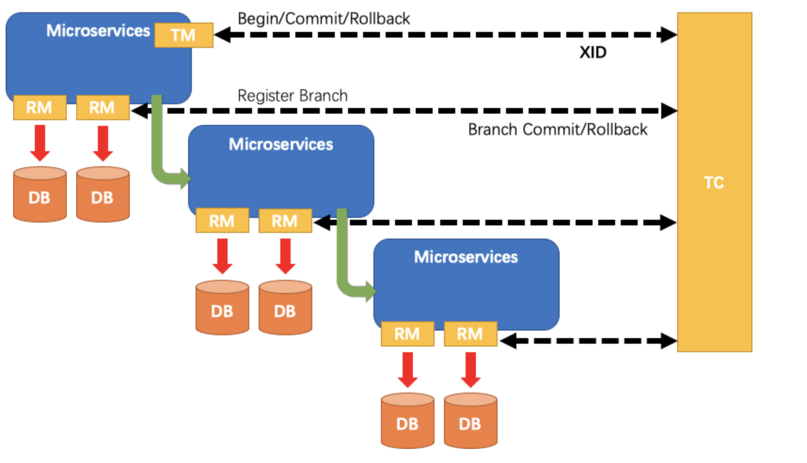

- TM:事务的发起者。用来告诉TC，全局事务的开始，提交，回滚。
- RM:具体的事务资源，每一个RM都会作为一个分支事务注册在TC。
- TC:事务的协调者。也可以看做是Fescar-server，用于接收我们的事务的注册，提交和回滚。

在之前的文章中对整个角色有个大体的介绍，在这篇文章中我将重点介绍其中的核心角色TC，也就是事务协调器。

# 2.Transcation Coordinator
为什么之前一直强调 TC 是核心呢？那因为TC这个角色就好像上帝一样，管控着云云众生的RM和TM。如果TC一旦不好使，那么RM和TM一旦出现小问题，那必定会乱的一塌糊涂。所以要想了解Seata，那么必须要了解它的TC。

那么一个优秀的事务协调者应该具备哪些能力呢？我觉得应该有以下几个:
- 正确的协调：能正确的协调RM和TM接下来应该做什么，做错了应该怎么办，做对了应该怎么办。
- 高可用: 事务协调器在分布式事务中很重要，如果不能保证高可用，那么它也没有存在的必要了。
- 高性能：事务协调器的性能一定要高，如果事务协调器性能有瓶颈那么它所管理的RM和TM那么会经常遇到超时，从而引起回滚频繁。
- 高扩展性：这个特点是属于代码层面的，如果是一个优秀的框架，那么需要给使用方很多自定义扩展，比如服务注册/发现，读取配置等等。

下面我也将逐步阐述Seata是如何做到上面四点。

## 2.1 Seata-Server的设计

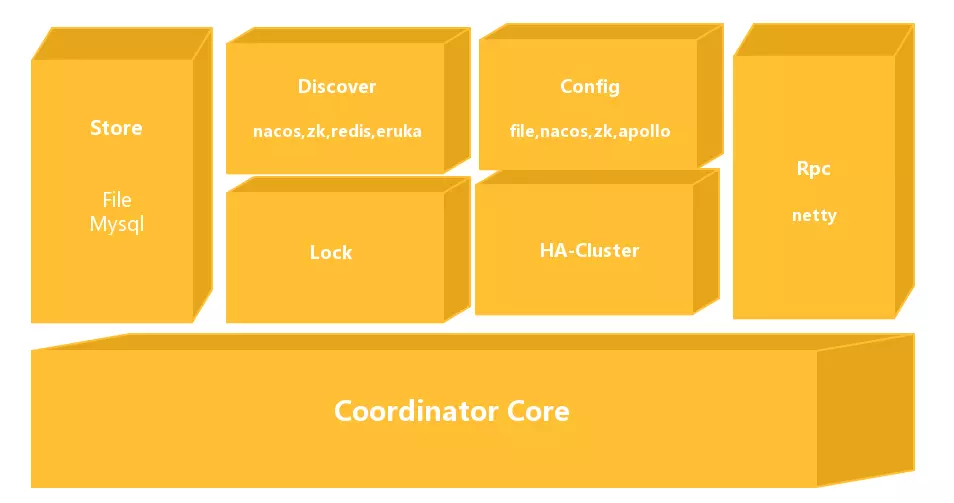

Seata-Server整体的模块图如上所示:
- Coordinator Core: 在最下面的模块是事务协调器核心代码，主要用来处理事务协调的逻辑，如是否commit,rollback等协调活动。
- Store:存储模块，用来将我们的数据持久化，防止重启或者宕机数据丢失。
- Discovery: 服务注册/发现模块，用于将Server地址暴露给我们Client。
- Config: 用来存储和查找我们服务端的配置。
- Lock: 锁模块，用于给Seata提供全局锁的功能。
- RPC:用于和其它端通信。
- HA-Cluster:高可用集群，目前还没开源，为Seata提供可靠的高可用服务，预计将会在0.6版本开源。

## 2.2 Discovery

首先来讲讲比较基础的Discovery模块，又称服务注册/发现模块。我们将Seata-Sever启动之后，需要将自己的地址暴露给其它使用者，那么就需要我们这个模块帮忙。

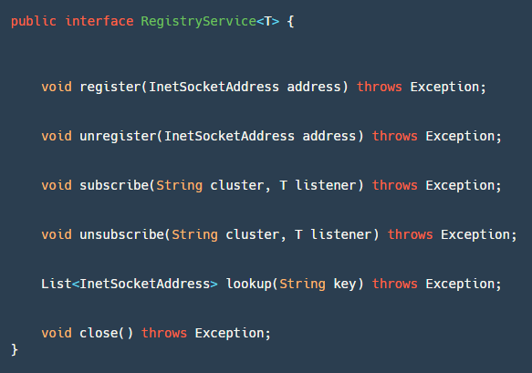

这个模块有个核心接口RegistryService，如上图所示:
- register：服务端使用，进行服务注册。
- unregister：服务端使用，一般在JVM关闭钩子，ShutdownHook中调用。
- subscribe：客户端使用，注册监听事件，用来监听地址的变化。
- unsubscribe：客户端使用，取消注册监听事件。
- lookup：客户端使用，根据key查找服务地址列表。
- close：都可以使用，用于关闭Registry资源。

如果需要添加自己定义的服务注册/发现，那么实现这个接口即可。截止目前在社区的不断开发推动下，已经有五种服务注册/发现，分别是redis、zk、nacos、eruka 和 consul。下面简单介绍下Nacos的实现：

#### 2.2.1 register接口：
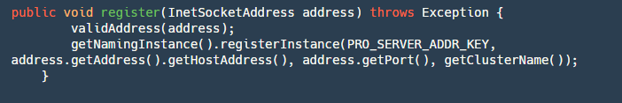

step1:校验地址是否合法

step2:获取Nacos的 Naming 实例，然后将地址注册到服务名为 serverAddr（固定服务名） 的对应集群分组（registry.conf 文件配置）上面。

unregister接口类似，这里不做详解。

#### 2.2.2 lookup接口：
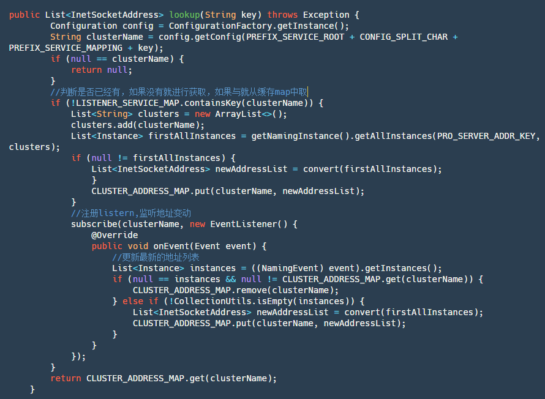

step1：获取当前clusterName名字。

step2：判断当前集群名对应的服务是否已经订阅过了，如果是直接从map中取订阅返回的数据。

step3：如果没有订阅先主动查询一次服务实例列表，然后添加订阅并将订阅返回的数据存放到map中，之后直接从map获取最新数据。

#### 2.2.3 subscribe接口

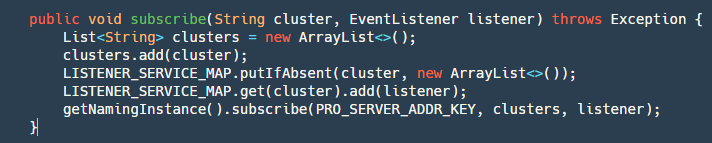

这个接口比较简单，具体分两步:

step1：对将要订阅的cluster-> listener 存放到map中，此处nacos未提交单机已订阅列表，所以需要自己实现。

step2：使用Nacos api 订阅。
## 2.3 Config
配置模块也是一个比较基础，比较简单的模块。我们需要配置一些常用的参数比如:Netty的select线程数量，work线程数量，session允许最大为多少等等，当然这些参数再Seata中都有自己的默认设置。

同样的在Seata中也提供了一个接口Configuration，用来自定义我们需要的获取配置的地方:

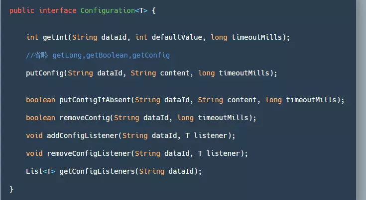

- getInt/Long/Boolean/getConfig()：通过dataId来获取对应的值，读取不到配置、异常或超时将返回参数中的默认值。
- putConfig：用于添加配置。
- removeConfig：删除一个配置。
- add/remove/get ConfigListener：添加/删除/获取 配置监听器，一般用来监听配置的变更。

目前为止有四种方式获取Config：File(文件获取)、Nacos、Apollo 和 ZK（不推荐）。在Seata中首先需要配置registry.conf，来配置config.type 。实现conf比较简单这里就不深入分析。
## 2.4 Store
存储层的实现对于Seata是否高性能，是否可靠非常关键。
如果存储层没有实现好，那么如果发生宕机，在TC中正在进行分布式事务处理的数据将会被丢失，既然使用了分布式事务，那么其肯定不能容忍丢失。如果存储层实现好了，但是其性能有很大问题，RM可能会发生频繁回滚那么其完全无法应对高并发的场景。

在Seata中默认提供了文件方式的存储，下面我们定义我们存储的数据为Session，而我们的TM创造的全局事务操作数据叫GloabSession，RM创造的分支事务操作数据叫BranchSession，一个GloabSession可以拥有多个BranchSession。我们的目的就是要将这么多Session存储下来。

在FileTransactionStoreManager#writeSession代码中:

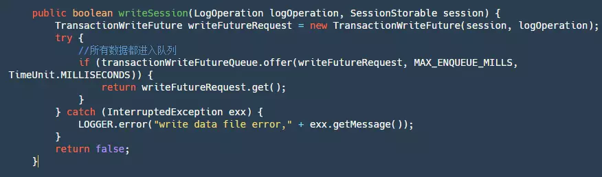

上面的代码主要分为下面几步：
- step1：生成一个TransactionWriteFuture。
- step2：将这个futureRequest丢进一个LinkedBlockingQueue中。为什么需要将所有数据都丢进队列中呢？当然这里其实也可以用锁来实现，再另外一个阿里开源的RocketMQ中，使用的锁。不论是队列还是锁它们的目的是为了保证单线程写，这又是为什么呢？有人会解释说，需要保证顺序写，这样速度就很快，这个理解是错误的，我们的FileChannel的写方法是线程安全的，已经能保证顺序写了。保证单线程写其实是为了让我们这个写逻辑都是单线程的，因为可能有些文件写满或者记录写数据位置等等逻辑，当然这些逻辑都可以主动加锁去做，但是为了实现简单方便，直接再整个写逻辑排队处理是最为合适的。
- step3：调用future.get，等待我们该条数据写逻辑完成通知。

我们将数据提交到队列之后，我们接下来需要对其进行消费，代码如下：

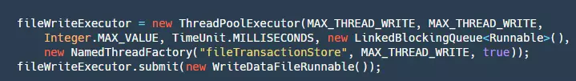

这里将一个WriteDataFileRunnable()提交进我们的线程池，这个Runnable的run()方法如下:

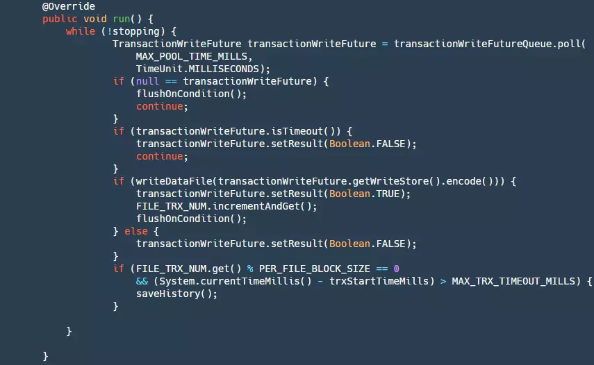

分为下面几步:

step1： 判断是否停止，如果stopping为true则返回null。

step2：从我们的队列中获取数据。

step3：判断future是否已经超时了，如果超时，则设置结果为false，此时我们生产者get()方法会接触阻塞。

step4：将我们的数据写进文件，此时数据还在pageCahce层并没有刷新到磁盘，如果写成功然后根据条件判断是否进行刷盘操作。

step5：当写入数量到达一定的时候，或者写入时间到达一定的时候，需要将我们当前的文件保存为历史文件，删除以前的历史文件，然后创建新的文件。这一步是为了防止我们文件无限增长，大量无效数据浪费磁盘资源。

在我们的writeDataFile中有如下代码:

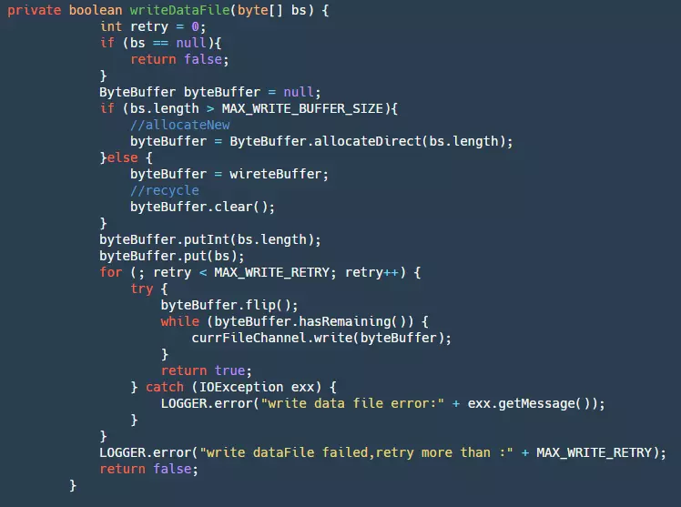

step1：首先获取我们的ByteBuffer，如果超出最大循环BufferSize就直接创建一个新的，否则就使用我们缓存的Buffer。这一步可以很大的减少GC。

step2：然后将数据添加进入ByteBuffer。

step3：最后将ByteBuffer写入我们的fileChannel,这里会重试三次。此时的数据还在pageCache层，受两方面的影响，OS有自己的刷新策略，但是这个业务程序不能控制，为了防止宕机等事件出现造成大量数据丢失，所以就需要业务自己控制flush。下面是flush的代码:

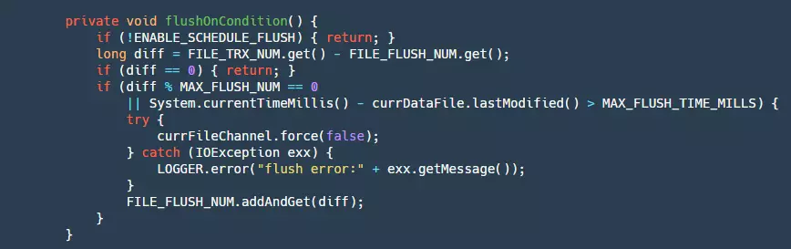

这里flush的条件写入一定数量或者写的时间超过一定时间，这样也会有个小问题如果是停电，那么pageCache中有可能还有数据并没有被刷盘，会导致少量的数据丢失。目前还不支持同步模式，也就是每条数据都需要做刷盘操作，这样可以保证每条消息都落盘，但是性能也会受到极大的影响，当然后续会不断的演进支持。

我们的store核心流程主要是上面几个方法，当然还有一些比如，session重建等，这些比较简单，读者可以自行阅读。

## 2.5 Lock
大家知道数据库实现隔离级别主要是通过锁来实现的，同样的再分布式事务框架Seata中要实现隔离级别也需要通过锁。一般在数据库中数据库的隔离级别一共有四种:读未提交，读已提交，可重复读，串行化。在Seata中可以保证隔离级别是读已提交，但是提供了达到读已提交隔离的手段。

Lock模块也就是Seata实现隔离级别的核心模块。在Lock模块中提供了一个接口用于管理我们的锁:
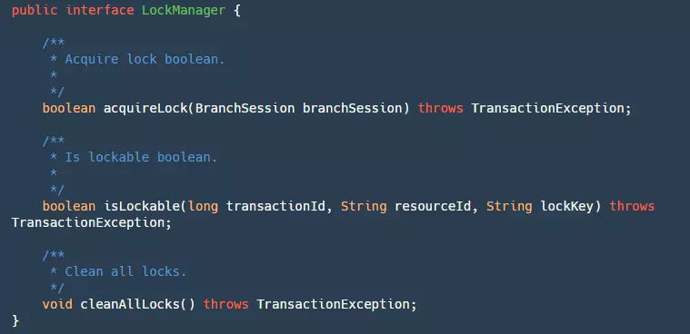

其中有三个方法:
- acquireLock：用于对我们的BranchSession加锁，这里虽然是传的分支事务Session，实际上是对分支事务的资源加锁，成功返回true。
- isLockable：根据事务ID，资源Id，锁住的Key来查询是否已经加锁。
- cleanAllLocks：清除所有的锁。
对于锁我们可以在本地实现，也可以通过redis或者mysql来帮助我们实现。官方默认提供了本地全局锁的实现：
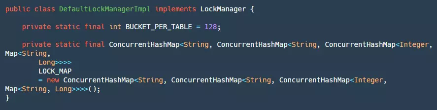

在本地锁的实现中有两个常量需要关注:
- BUCKET_PER_TABLE：用来定义每个table有多少个bucket，目的是为了后续对同一个表加锁的时候减少竞争。
- LOCK_MAP：这个map从定义上来看非常复杂，里里外外套了很多层Map，这里用个表格具体说明一下：

层数 | key| value
---|---|---
1-LOCK_MAP | resourceId（jdbcUrl） | dbLockMap
2- dbLockMap | tableName （表名） | tableLockMap
3- tableLockMap | PK.hashcode%Bucket （主键值的hashcode%bucket） | bucketLockMap
4- bucketLockMap | PK | trascationId

可以看见实际上的加锁在bucketLockMap这个map中，这里具体的加锁方法比较简单就不作详细阐述，主要是逐步的找到bucketLockMap,然后将当前trascationId塞进去，如果这个主键当前有TranscationId，那么比较是否是自己，如果不是则加锁失败。

## 2.6 RPC
保证Seata高性能的关键之一也是使用了Netty作为RPC框架，采用默认配置的线程模型如下图所示：

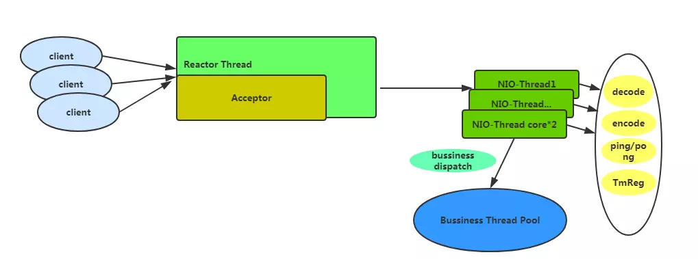

如果采用默认的基本配置那么会有一个Acceptor线程用于处理客户端的链接，会有cpu*2数量的NIO-Thread，再这个线程中不会做业务太重的事情，只会做一些速度比较快的事情，比如编解码，心跳事件，和TM注册。一些比较费时间的业务操作将会交给业务线程池，默认情况下业务线程池配置为最小线程为100，最大为500。

Seata 目前允许配置的传输层配置如图所示，用户可根据需要进行Netty传输层面的调优，配置通过配置中心配置，首次加载时生效。  

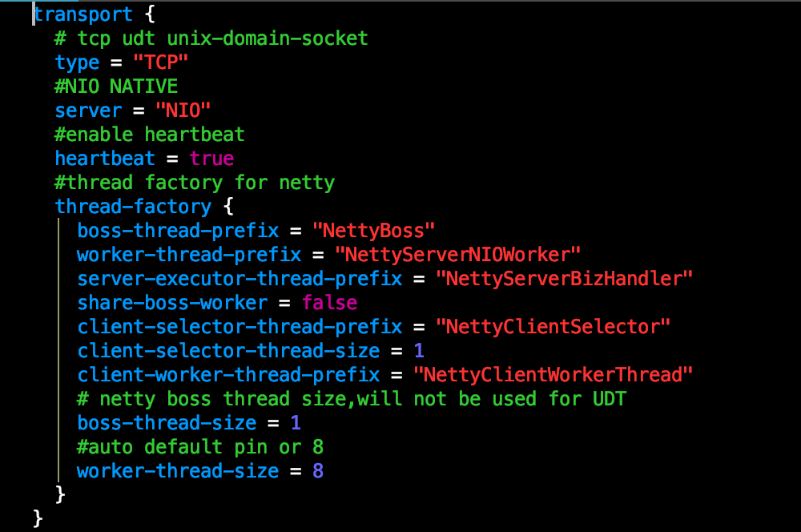    
这里需要提一下的是Seata的心跳机制，这里是使用Netty的IdleStateHandler完成的，如下:

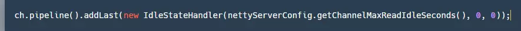

在Sever端对于写没有设置最大空闲时间，对于读设置了最大空闲时间，默认为15s(客户端默认写空闲为5s，发送ping消息)，如果超过15s则会将链接断开，关闭资源。

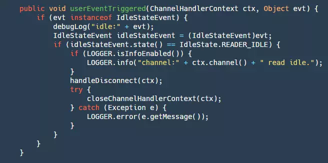

step1：判断是否是读空闲的检测事件。

step2：如果是则断开链接，关闭资源。   
另外Seata 做了内存池、客户端做了批量小包合并发送、Netty连接池（减少连接创建时的服务不可用时间）等功能，以下为批量小包合并功能。   
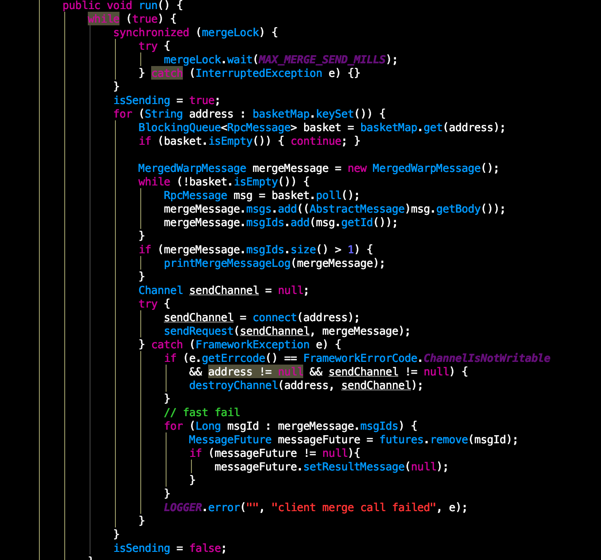      
客户端的消息发送并不是真正的消息发送通过 AbstractRpcRemoting#sendAsyncRequest 包装成 RpcMessage 存储至 basket 中并唤醒合并发送线程。合并发送线程通过 while true 的形式
最长等待1ms对basket的消息取出包装成 merge 消息进行真正发送，此时若 channel 出现异常则会通过 fail-fast 快速失败返回结果。merge消息发送前在 map 中标识，收到结果后批量确认（AbstractRpcRemotingClient#channelRead），并通过 dispatch 分发至 messageListener 和 handler 去处理。同时，timerExecutor 定时对已发送
消息进行超时检测，若超时置为失败。具体消息协议设计将会在后续的文章中给出，敬请关注。   
Seata 的 Netty Client由 TMClient和RMClient 组成，根据事务角色功能区分，都继承 AbstractRpcRemotingClient，AbstractRpcRemotingClient 实现了 RemotingService（服务启停）, RegisterMsgListener（netty 连接池连接创建回调）和 ClientMessageSender（消息发送）继承了 AbstractRpcRemoting（ Client和Server 顶层消息发送和处理的模板）。    
RMClient类关系图如下图所示：
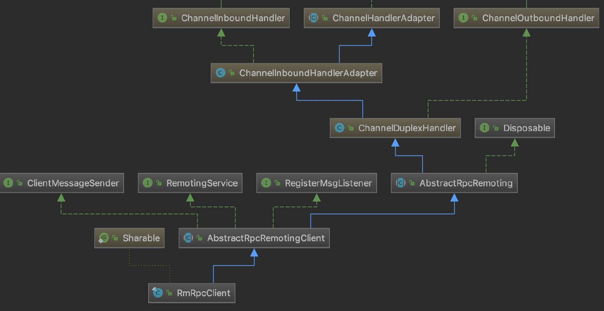
TMClient 和 RMClient 又会根据自身的 poolConfig 配置与 NettyPoolableFactory implements KeyedPoolableObjectFactory<NettyPoolKey, Channel> 进行 channel 连接的交互，channel 连接池根据角色 key+ip 作为连接池的 key 来定位各个连接池
，连接池对 channel 进行统一的管理。TMClient 和 RMClient 在发送过程中对于每个 ip 只会使用一个长连接，但连接不可用时，会从连接池中快速取出已经创建好并可用的连接，减少服务的不可用时间。

## 2.7 HA-Cluster
目前官方没有公布HA-Cluster,但是通过一些其它中间件和官方的一些透露，可以将HA-Cluster用如下方式设计:
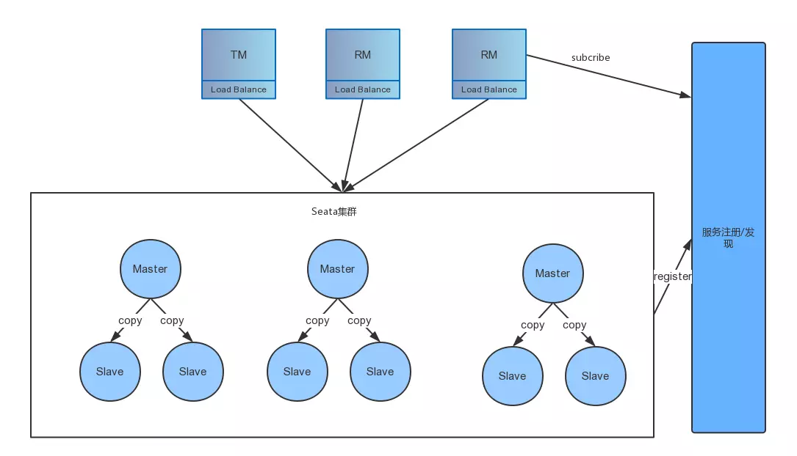

具体的流程如下:

step1：客户端发布信息的时候根据transcationId保证同一个transcation是在同一个master上，通过多个Master水平扩展，提供并发处理性能。

step2：在server端中一个master有多个slave，master中的数据近实时同步到slave上，保证当master宕机的时候，还能有其它slave顶上来可以用。

当然上述一切都是猜测，具体的设计实现还得等0.5版本之后。目前有一个Go版本的Seata-Server也捐赠给了Seata(还在流程中)，其通过raft实现副本一致性，其它细节不是太清楚。

## 2.8 Metrics  
这个模块也是一个没有具体公布实现的模块，当然有可能会提供插件口，让其它第三方metric接入进来，最近Apache SkyWalking 正在和Seata小组商讨如何接入进来。

# 3.Coordinator Core
上面我们讲了很多Server基础模块，想必大家对Seata的实现已经有个大概，接下来我会讲解事务协调器具体逻辑是如何实现的，让大家更加了解Seata的实现内幕。

## 3.1 启动流程
启动方法在Server类有个main方法，定义了我们启动流程：

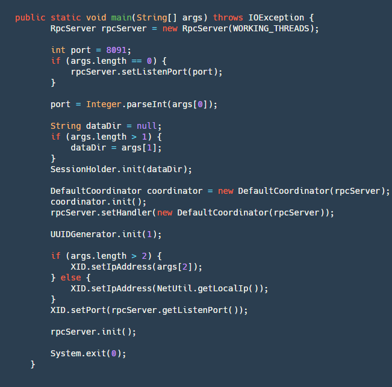

step1：创建一个RpcServer，再这个里面包含了我们网络的操作，用Netty实现了服务端。

step2：解析端口号、本地文件地址（用户Server宕机未处理完成事务恢复)、IP(可选，本机只能获取内网ip，在跨网络时需要一个对外的vip注册服务)。

step3：初始化SessionHoler,其中最重要的重要就是重我们dataDir这个文件夹中恢复我们的数据，重建我们的Session。

step4：创建一个CoorDinator,这个也是我们事务协调器的逻辑核心代码，然后将其初始化，其内部初始化的逻辑会创建四个定时任务：
- retryRollbacking：重试rollback定时任务，用于将那些失败的rollback进行重试的，每隔5ms执行一次。
- retryCommitting：重试commit定时任务，用于将那些失败的commit进行重试的，每隔5ms执行一次。
- asyncCommitting：异步commit定时任务，用于执行异步的commit，每隔10ms一次。
- timeoutCheck：超时定时任务检测，用于检测超时的任务，然后执行超时的逻辑，每隔2ms执行一次。

step5： 初始化UUIDGenerator这个也是我们生成各种ID(transcationId,branchId)的基本类。

step6：将本地IP和监听端口设置到XID中，初始化rpcServer等待客户端的连接。

启动流程比较简单，下面我会介绍分布式事务框架中的常见的一些业务逻辑Seata是如何处理的。
## 3.2 Begin-开启全局事务
一次分布式事务的起始点一定是开启全局事务，首先我们看看全局事务Seata是如何实现的：

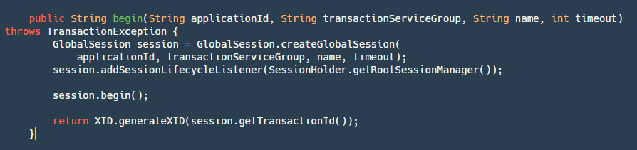

step1： 根据应用ID，事务分组，名字，超时时间创建一个GloabSession，这个在前面也提到过它和branchSession分别是什么。

step2：对其添加一个RootSessionManager用于监听一些事件，这里要说一下目前在Seata里面有四种类型的Listener(这里要说明的是所有的sessionManager都实现了SessionLifecycleListener)：
- ROOT_SESSION_MANAGER：最全，最大的，拥有所有的Session。
- ASYNC_COMMITTING_SESSION_MANAGER：用于管理需要做异步commit的Session。
- RETRY_COMMITTING_SESSION_MANAGER：用于管理重试commit的Session。
- RETRY_ROLLBACKING_SESSION_MANAGER：用于管理重试回滚的Session。
由于这里是开启事务，其它SessionManager不需要关注，我们只添加RootSessionManager即可。

step3：开启Globalsession

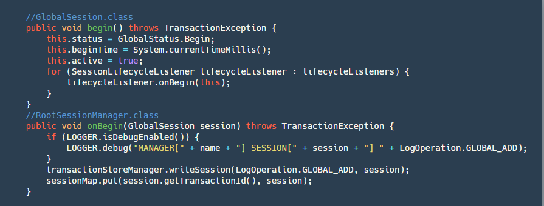

这一步会把状态变为Begin,记录开始时间,并且调用RootSessionManager的onBegin监听方法，将Session保存到map并写入到我们的文件。

step4：最后返回XID，这个XID是由 ip+port+transactionId 组成的，非常重要，当TM申请到之后需要将这个ID传到RM中，RM通过XID来决定到底应该访问哪一台Server。

## 3.3 BranchRegister-分支事务注册
当我们全局事务在TM开启之后，我们RM的分支事务也需要注册到我们的全局事务之上，这里看看是如何处理的：

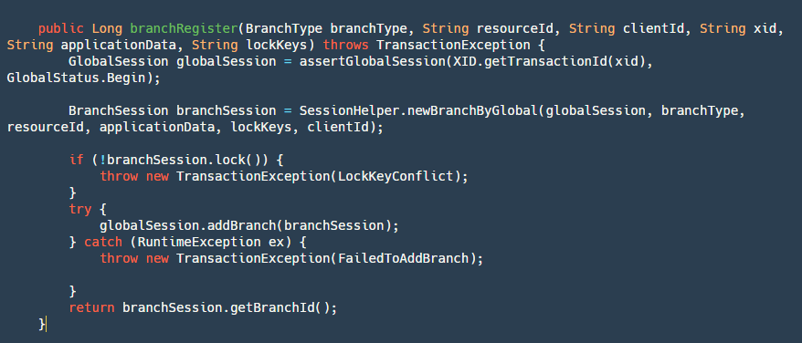

step1：通过transactionId获取并校验全局事务是否是开启状态。

step2：创建一个新的分支事务，也就是我们的BranchSession。

step3：对分支事务进行加全局锁，这里的逻辑就是使用的我们锁模块的逻辑。

step4：添加branchSession，主要是将其添加到globalSession对象中，并写入到我们的文件中。

step5：返回branchId,这个ID也很重要，我们后续需要用它来回滚我们的事务，或者对我们分支事务状态更新。

分支事务注册之后，还需要汇报分支事务的本地事务的执行到底是成功还是失败，在Server目前只是简单的做一下保存记录，汇报的目的是，就算这个分支事务失败，如果TM还是执意要提交全局事务（catch 异常不抛出），那么再遍历提交分支事务的时候，这个失败的分支事务就不需要提交（用户选择性跳过）。

## 3.4 GlobalCommit - 全局提交

当我们分支事务执行完成之后，就轮到我们的TM-事务管理器来决定是提交还是回滚，如果是提交，那么就会走到下面的逻辑:

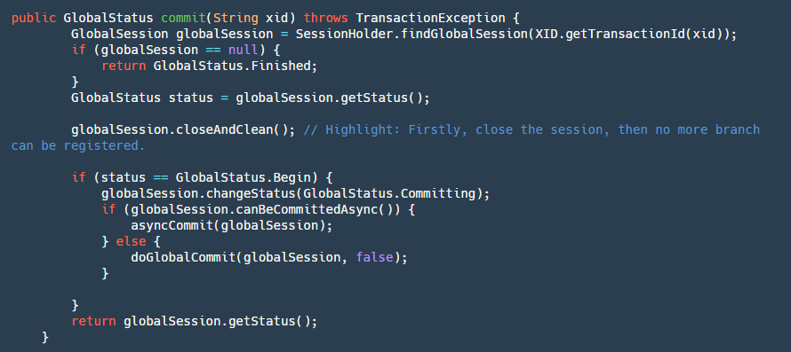

step1：首先找到我们的globalSession。如果它为null证明已经被commit过了，那么直接幂等操作，返回成功。

step2：关闭我们的GloabSession防止再次有新的branch进来(跨服务调用超时回滚，provider在继续执行)。

step3：如果status是等于Begin，那么久证明还没有提交过，改变其状态为Committing也就是正在提交。

step4：判断是否是可以异步提交，目前只有AT模式可以异步提交，二阶段全局提交时只是删除undolog并无严格顺序，此处使用定时任务，客户端收到后批量合并删除。

step5：如果是异步提交，直接将其放进我们ASYNC_COMMITTING_SESSION_MANAGER，让其再后台线程异步去做我们的step6，如果是同步的那么直接执行我们的step6。

step6：遍历我们的BranchSession进行提交，如果某个分支事务失败，根据不同的条件来判断是否进行重试，可异步执行此branchSession不成功可以继续执行下一个，因为其本身都在manager中，只要没有成功就不会被删除会一直重试，如果是同步提交的会放进重试队列进行定时重试并卡住按照顺序提交。

## 3.5 GlobalRollback - 全局回滚

如果我们的TM决定全局回滚，那么会走到下面的逻辑：

这个逻辑和提交流程基本一致，可以看作是它的反向，这里就不展开讲了。

# 4.总结
最后在总结一下开始我们提出了分布式事务的关键4点，Seata到底是怎么解决的：
- 正确的协调：通过后台定时任务各种正确的重试，并且未来会推出监控平台有可能可以手动回滚。
- 高可用: 通过HA-Cluster保证高可用。
- 高性能：文件顺序写，RPC通过netty实现，Seata未来可以水平扩展，提高处理性能。
- 高扩展性：提供给用户可以自由实现的地方，比如配置，服务发现和注册，全局锁等等。

最后希望大家能从这篇文章能了解Seata-Server的核心设计原理，当然你也可以想象如果你自己去实现一个分布式事务的Server应该怎样去设计？

Seata GitHub地址：https://github.com/seata/seata   

本文作者：

李钊，GitHub ID @CoffeeLatte007，公众号「咖啡拿铁」作者，Seata社区 Committer，猿辅导Java工程师，曾就职于美团。对分布式中间件，分布式系统有浓厚的兴趣。   
季敏(清铭)，GitHub ID @slievrly，Seata 开源项目负责人，阿里巴巴中间件 TXC/GTS 核心研发成员，长期从事于分布式中间件核心研发工作，在分布式事务领域有着较丰富的技术积累。
